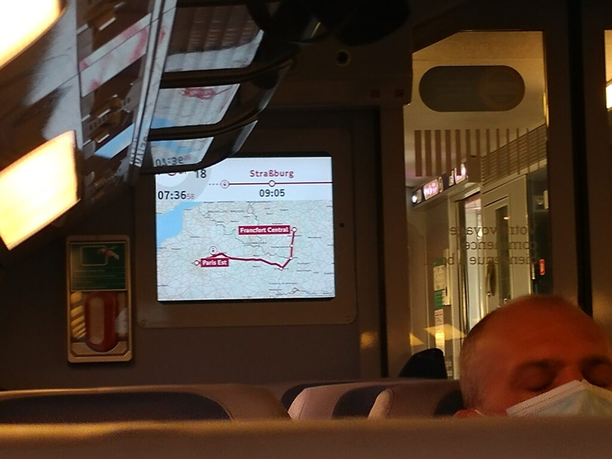

**TL;DR** Too long; didn't read : acronyme cher à nos amis anglophones, soit un petit resumé pour ceux qui ne veulent que regarder les photos ! :) Nous avons organisé notre voyage en 3 étapes : Paris-Hambourg, Hambourg-Copenhague, Copenhague-Stockholm. Nous avons mis 3 jours en dormant a Hambourg et Copenhague, avant de prendre un train de nuit de Malmö à Sotckholm. Le but était d'éviter de prendre l'avion et de voir quelques villes européennes puisque nous avions le temps. Pour Hambourg, c'était un peu rapide, mais nous avons vraiment apprécié Copenhague !

Ça y est, c'est le jour J. Comme d’hab, on a fini les sacs tard, du coup on a dormi 4 ou 5 heures ! Mais on y est ! Emelyne, grande reporter, immortalise nos bagages. Ca parait beaucoup, mais on part pour une année C'est parti pour la première étape du trajet: Paris-Francfort-Hambourg. Départ matinal pour une arrivée en fin d'après-midi ce lundi 2 novembre 2020 !

Le train vient de démarrer et on est parti pour découvrir de nouveaux horizons.

Au revoir Paris ! 👋

Nous avons organisé notre voyage en 3 étapes : Paris-Hambourg, Hambourg-Copenhague, Copenhague-Stockholm.

Paris gare de l’est – Hambourg (via Francfort)

* * *

Premier (et dernier) voyage du séjour avec la SNCF:

Nous avons pris un train faisant Paris Gare de l’est à Francfort puis Francfort à Hambourg. C’était ce qu’il y avait de moins cher dans les billets de train (il y avait aussi la possibilité de faire un changement par Cologne).

On a eu le meilleur contrôleur du monde. Un germanophone trilingue qui transmettait la bonne humeur avec son flow incroyable ! Mais il n'aimait pas les colis abandonnés ! 😂 Si vous entendez un jour Camille dire « Jo, meine Damen and Herren », ça vient de ce cher contrôleur ! 😉

On a eu beaucoup de champs et de zones industrielles pendant une grande partie de la traversée de la France et du début de l’Allemagne, c'était moyennement enthousiasmant. Mais après avoir pénétré en Allemagne, on a traversé beaucoup de forêt. C’était déjà plus sympa ! Ça faisait penser à la série allemande [Dark](https://www.themoviedb.org/tv/70523-dark?language=fr-FR). 😊

<https://www.youtube.com/watch?v=CMzOp-2jayE>

Petite pause à Frankfurt, où les toilettes sont payantes et où Camille a eu un coup de stress car il ne trouvait plus le billet de train pour le Danemark et il n'avait pas eu de mail de la compagnie de train ! Heureusement, une guichetière sympa a retrouvé nos tickets et nous les a imprimés. L'aventure a pu continuer.

La Deutsch Bahn n’a pas manqué à sa réputation, notre train a été en retard et a changé de quai ! Et en plus on s’est fait sortir de la première classe lors du contrôle des billets alors qu’il n’y avait personne ! 😢 On aura tenté ! 😂 Mais on est bien parti pour Hambourg !

Hambourg – Copenhague

* * *

Après une nuit de pause à Hambourg, nous sommes parti le midi avec un autre train direction Copenhague qui était également en retard, mais sur le bon quai ! Merci la Deutsch Bahn ! 😂

Du coup, fin de la traversée de l’Allemagne et on voit toujours énormément de champs. Le train s’est arrêté aussitôt la frontière Danoise franchie, et hop ! Contrôle de la douane ! On s’attendait à un contrôle par les Danois vu leur politique face au Covid, mais la différence était impressionnante face à l’Allemagne où on ne nous a rien demandé. Contrôle des billets, des passeports, de la réservation d’hotel, du billet de départ du pays et du contrat de travail qui nous permettait de voyager ! Il n'a finalement vérifié que pour Camille, car c'était trop long pour deux personnes !

Bref, le train est reparti - sans que personne ne soit jeté par-dessus bord par les douaniers 😂- et on a commencé la traversé du Danemark ! C’était super ! Des paysages verdoyants avec pas mal d’étendues d’eau ! Le train passe sur plusieurs ponts, ce qui nous a permis de voir la mer !



Arrivé à la gare de København H la nuit ! Si vous y passez, jetez un coup d’œil à la charpente. Elle est intégralement en bois, c’est une beauté architecturale !

Copenhague – Stockholm (via Malmö)

* * *

Nous voici à la dernière étape du trajet !

On a pris une sorte de TER qui fait le trajet de Copenhague à Malmo et voilà ! La Suède !!! Notre première étape de cette année de césure !

 
  

Désolé pour le dialogue, je crois que nos cerveaux accusaient la fatigue du voyage !

Nous n’avons pas attendu longtemps notre train suivant. Il y a 9h de trajet donc nous avons décidé de voyager de nuit. Du coup ce n'est pas terrible pour voir les paysages ! 😅

On ne savait pas si ce seraient des trains couchettes ou pas. Depuis le quai, on a aperçu des couchettes, mais quand on est arrivé à nos places, on s’est retrouvé devant des sièges !

 
  

A la découverte du train de nuit !

Camille ne voulait pas passer une mauvaise nuit, sachant que dans un siège il n’arriverait jamais à dormir. Du coup, il est allé faire les yeux doux à la contrôleuse. La photo suivante vous donne le fin mot de l’histoire !



Camille, fier de sa force de persuasion et heureux de pouvoir dormir.

 
  

Notre "confortable" cabine de train !

Après une nuit plus ou moins reposante, nous sommes arrivés à Stockholm où nous avons passé de très bons moments ! La suite dans un prochain article !
