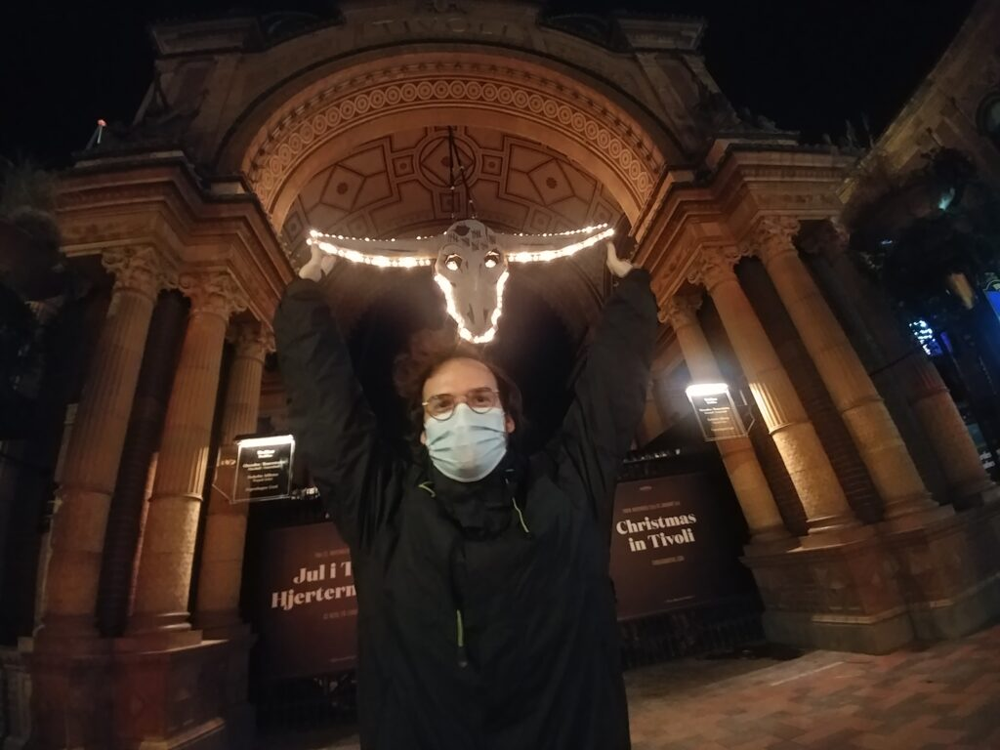
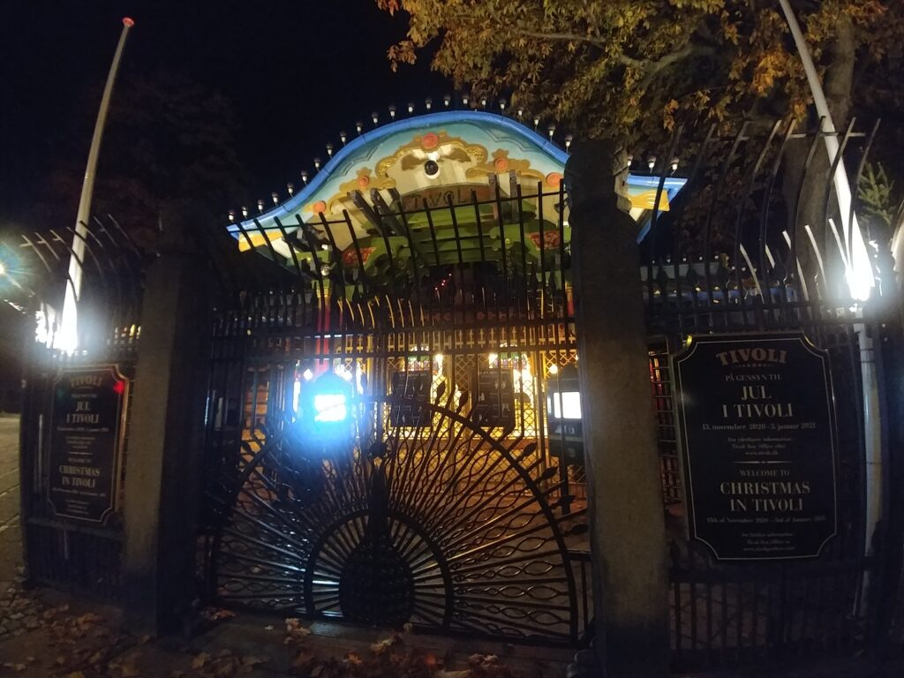
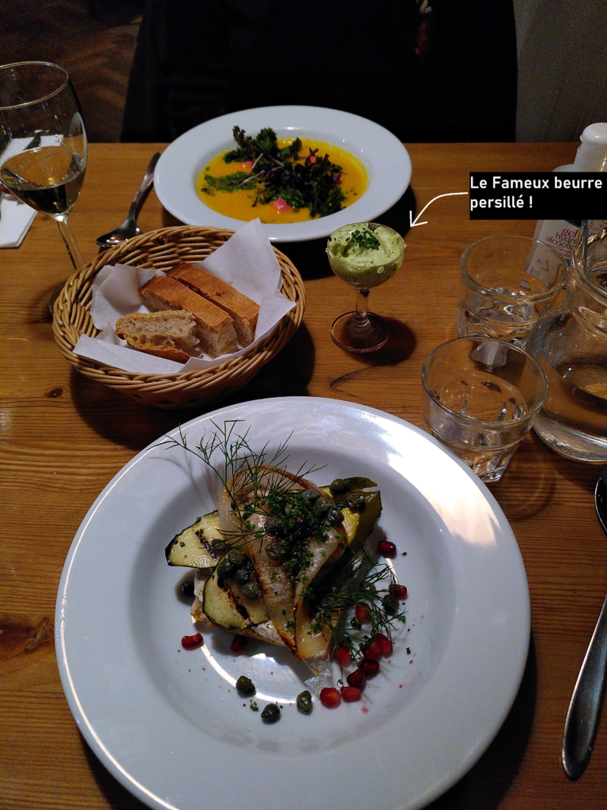
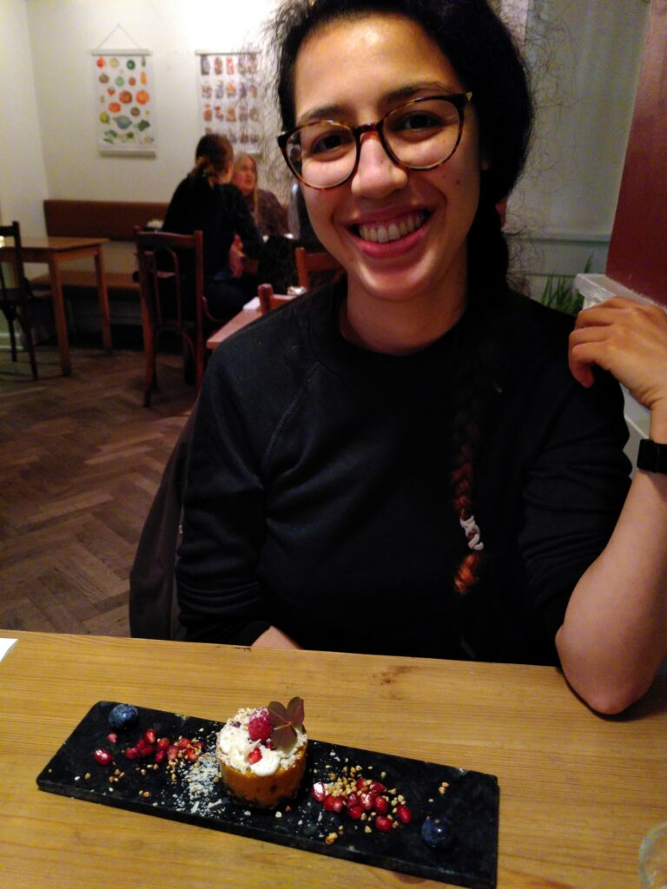
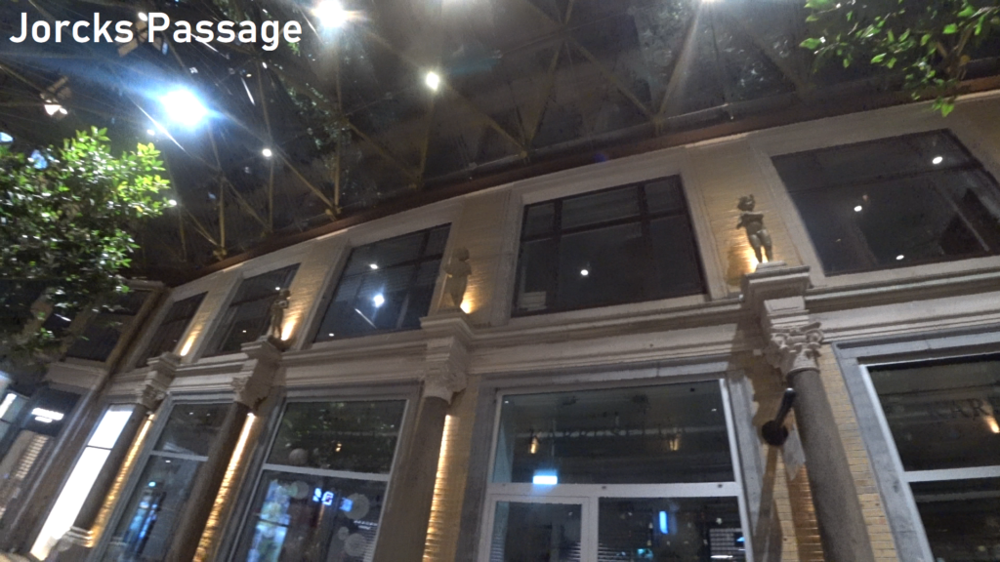
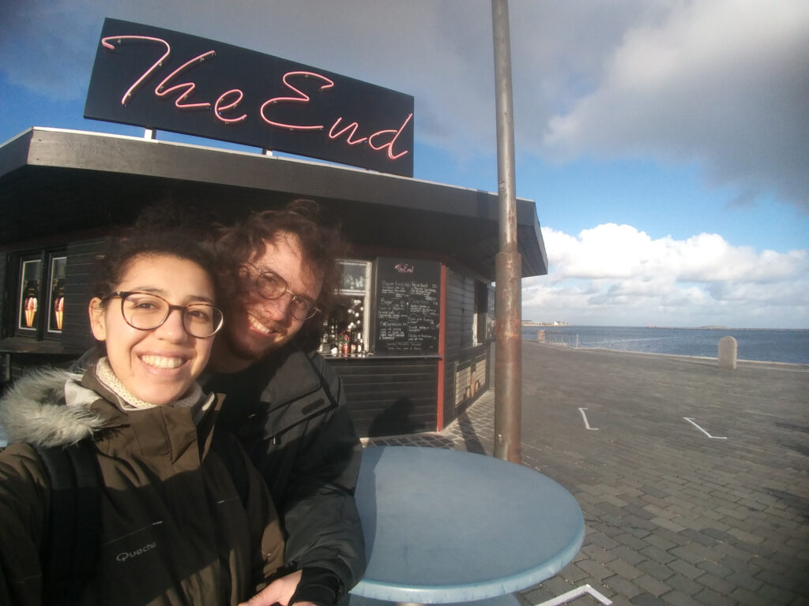

A peine sortis du train et nous sommes déjà dans notre chambre qui se trouvait en face de la gare ! Juste le temps de poser nos affaires, de télécharger la carte de la ville et c’était parti pour faire une première exploration de nuit de Copenhague !

Proches de la gare, on passe par de grands axes mais on rejoint assez rapidement le centre-ville. C’était l’occasion de passer devant Tivoli, le parc d’attraction de la ville et d’apercevoir ses lumières.

Camille devant les jardins de Tivoli de nuit !

Les mêmes jardins. sans l'intru !

J’ai été surprise par les nombreuses boutiques du centre-ville qui se logent en sous-sol !  
Il n’y a pas vraiment de rez-de-chaussée ! Depuis le trottoir, on a le choix entre monter quelques marches pour atteindre des logements/boutiques ou descendre d’autres marches pour accéder à la boutique dont on peut percevoir l’intérieur depuis les fenêtres au niveau des trottoirs !

Il y a beaucoup de boutiques d’artisans avec des créations plus cools les unes que les autres et on peut faire du lèche vitrine même de nuit !

Nous voilà arrivés au restaurant **[Urten](https://www.urtenvegan.dk/),** l’adresse que nous ne voulions pas rater. Le restaurant est divisé en deux : si vous souhaitez manger végan, il faut aller à l’étage et non au sous-sol ! C’est un lieu intimiste et décontracté où nous avons découvert du beurre en persillade servi dans un verre à pied pour apparemment le tartiner sur du pain… Nous n’avons pas tout à fait compris le concept car ce n’était pas pratique ! xD

Je m’égare ! Vous vous souvenez du dessin animé « Ratatouille », quand le rat explique l’explosion des saveurs ? Chez Urten, c’est exactement ce que nous avons ressenti. Tous les plats étaient excellents ! Des explosions des saveurs et d’épices ! <3

Petit hareng traditionnel néerlandais - Version végane !

Le gâteau ne le sait pas encore... Il n'a aucune chance contre Emelyne !

 Ce fut une bonne soirée et nous avons continué à profiter des détails de la ville de nuit sur le trajet du retour.

 

Il nous restait une journée pour profiter de Copenhague, cette fois-ci avec le soleil ! Nous avons laissé le matin nos bagages dans des casiers à la gare (la meilleure invention qui soit !).

Copenhague est connue pour privilégier la circulation à vélo, alors nous avons décidé de découvrir la ville sur nos selles. Nous nous sommes armés de vélo libre-service Donkey Bike et nous sommes partis en direction du quartier Christiana !

Ce que nous retenons, c’est que Copenhague est VRAIMENT une ville agréable à vélo. Bon… il faut arriver à comprendre les changements de voies, mais sinon c’est vraiment pratique et il y a de la place pour 3000 vélos sur leurs voies cyclables !

\- _Note de Camille : je ne conseille pas d’essayer d’aligner 3000 vélos, il se peut que la réalité ne cautionne pas l’enthousiasme d’Emelyne ! :P_ -

Nous recommandons Christiana, c'est vraiment atypique ! Plein de couleurs, d'art urbain, les canaux sont magnifiques. Nous avons pu y admirer une immense statue de bois. On enchaine, toujours à vélo et direction le petit port de Nyhavn. Plein de petits restos, ça doit être agréable pour une petite pause gastronomique ! Mais ce sera pour une prochaine fois, nous n'avons que 2 jours ! :) Nous continuons la traversée de la ville pour arriver à la fin. Littéralement. On a trouvé un petit kiosque appelé « The End ». xD Mais pas pour nous ! Nous continuons encore et toujours !

Petit passage par le Rosenborg Slot, magnifique château de la Renaissance ! Mais nous nous contentons de l’admirer depuis la rue, car 16 euros pour 30 minutes de visite dans notre planning serré, ce n’est pas forcement l’idée du siècle ! Mais nous gardons l’endroit en tête pour une future excursion ! Nous terminons intrigués par les bruits d’une petite fête du coin et nous allons investiguer. C’est une manifestation à Folketinget, égayée d’une batterie de casseroles sonores !  Un petit rassemblement d’anti-masques, anti-5G et autres. On a discuté un peu puis nous nous sommes enfuis pour rejoindre notre destination suivante !

Il est temps pour nous de se reposer de cette grande journée à vélo ! Direction [The Carribean Housewife,](https://thecaribbeanhousewife.com/) un restaurant végan situe cette année dans le quartier de Vesterbo. Plutôt cocasse quand on sait que Vesterbro est l’ancien quartier des abattoirs et boucheries de la ville ! :D Les temps changent ! Diner exceptionnel dans un cadre industriel bien mis en valeur. Et le service en français, s’il-vous-plait ! La serveuse était française, et très sympathique !

Ce fut une belle note finale pour notre séjour dans cette ville extraordinaire ! A bientôt Copenhague ! The End, mais c'est fois-ci pour de vrai !

https://youtu.be/axtnmEFUipM
