Nous arrivons enfin à Humble Habitat, une domaine forestier où vivent Eliza et David. David a grandi un partie de sa vie dans le Montana aux États-Unis. C’est là-bas qu’a vécu Eliza. Ils s’y sont rencontrés, avant de perdre le contact puis de finalement renouer les liens ! Ils sont aujourd’hui mariés et vivent ensemble sur ce terrain de Humble Habitat, près d’Hedemora en Dalarna (Dalécarlie). Ils ont deux chiens, Tygy et Bruno, qui sont, je crois, de type labrador retriever. Et un chat, Tobby, plus discret!

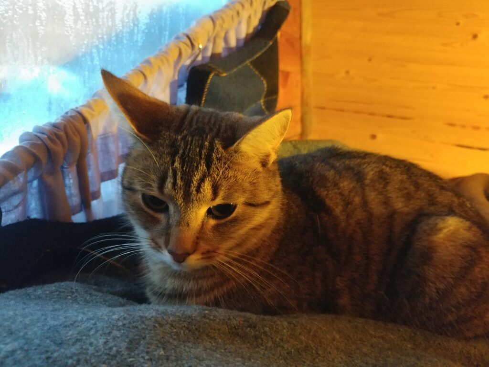

## L'atelier

C’est dans cet endroit que la magie se passe ! Nous y bidouillons les projets qui peuvent se faire en intérieur. Nous avons un poêle, un établi, des outils, de la lumière… Mais c’est surtout l’antre de David ! Il a toujours des projets plus intéressants les uns que les autres et il en finit la plupart ! David est un grand partisan d’avoir un problème à résoudre avant de se lancer dans quoi que ce soit. Impossible de lui extraire une information tant qu’il ne sait pas quel est l’objectif concret poursuivi ! :D  
Ça a le mérite de fonctionner pour lui, et c’est vrai qu’on perd moins de temps à amasser de la théorie quand on sait précisément le problème qu’on veut résoudre. Il va avoir un problème pour générer de l’électricité pendant l’hiver ? Il se renseigne sur les turbines hydrauliques et en construit un prototype. Il veut avoir plus de champignons à manger ? Il se renseigne sur leur culture, récupère des souches et tente plusieurs techniques en attendant de voir les résultats à l’automne. Sa vision des chose lui permet d’être très efficace et de ne pas trop s’éparpiller !

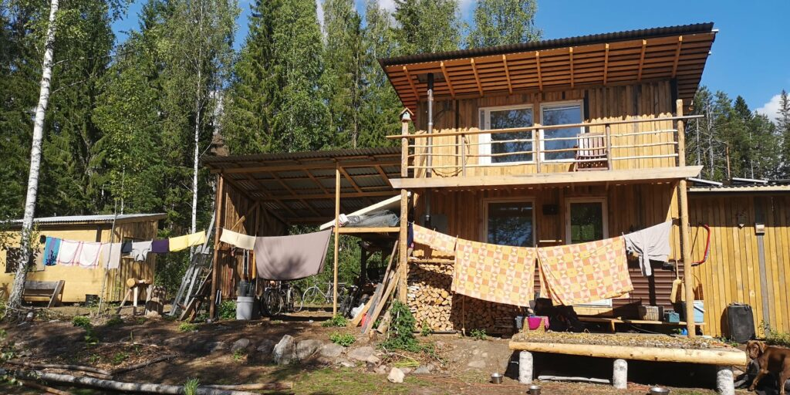

L'atelier en été - by David & Eliza

https://youtu.be/5EeY77brVQs

## La tiny house

Nous avons fait un article plus complet sur notre séjour dans la tiny house. Voici le [lien](http://camillebc.me/?p=228) pour y jeter un œil !

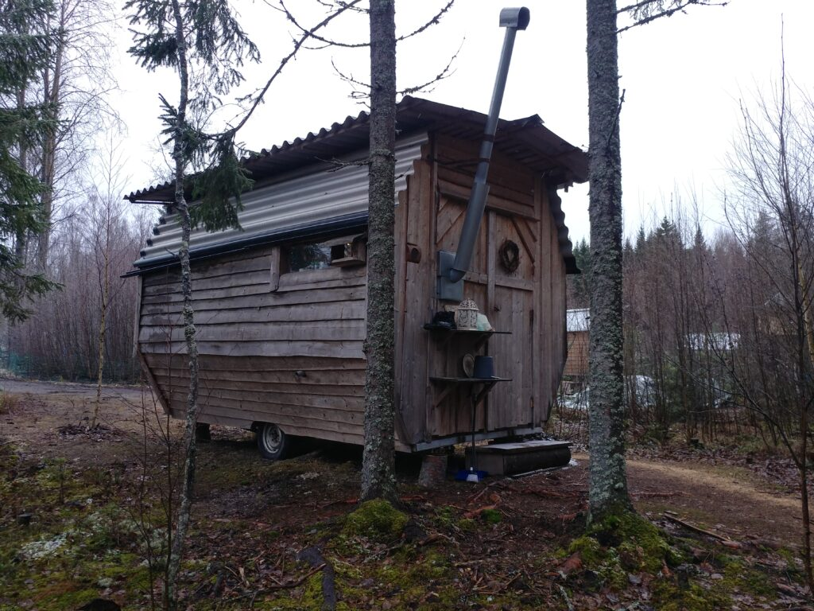

La tiny house à notre arrivée !

## La maison de David et Eliza

Nous habitons le premier essai de David dans les tiny houses. Sa deuxième tentative est bien plus impressionnante. Il a récupéré un camion pour construire sa maison ! David et Eliza n’ont pas de permis de construire pour le terrain sur lequel ils sont. L’atelier est la seule vraie structure en dur, et c’est uniquement car il s’agit d’un local professionnel. Il n’y a pas de cuisine, de lit ou de salle de bain dans ce local. Les structures à vivre sont toutes théoriquement amovible. David a été honnête, sa maison ne va pas se démonter facilement s’il en a l’obligation ! :D

Leur maison principale est très confortable, plus spacieuse que la version précédente. David et Eliza ont utilisé leur expérience de vie dans la petite tiny house pour construire une maison qui corresponde plus à leurs exigences de vie, avec des solutions plus adaptées à leur fonctionnement. Ça a l’air de fonctionner pour eux ! Et comme d’habitude avec ces constructions maîtrisées, il est facile d’améliorer l’existant ! Avant notre départ, David était en pleine réalisation avec Eliza d’une plateforme pour faire un sas et une petite serre à l’entrée de leur « not-so-tiny » house.

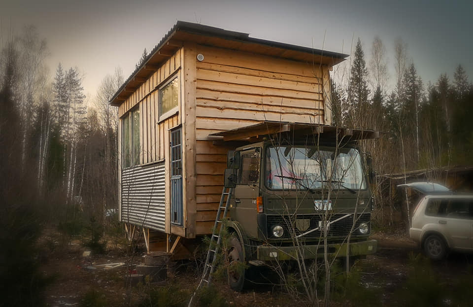

La "not-so-tiny" house - by David & Eliza

## L’enclos à lapins

David et Eliza ont quelques lapins dans un enclos pour leurs besoins en viande. Je dis quelques mais une lapine était enceinte, du coup l’élevage va s’agrandir !  
Les cabanes sont construites par David et Eliza et nous sommes amusés à regarder les lapins courir avec les chiens qui guettent derrière le grillage !  
Un de nos projets a été de construire une petite maison pour lapin afin de prévoir l’agrandissement de la famille ! Le lien est [ici](http://camillebc.me/?p=245) !

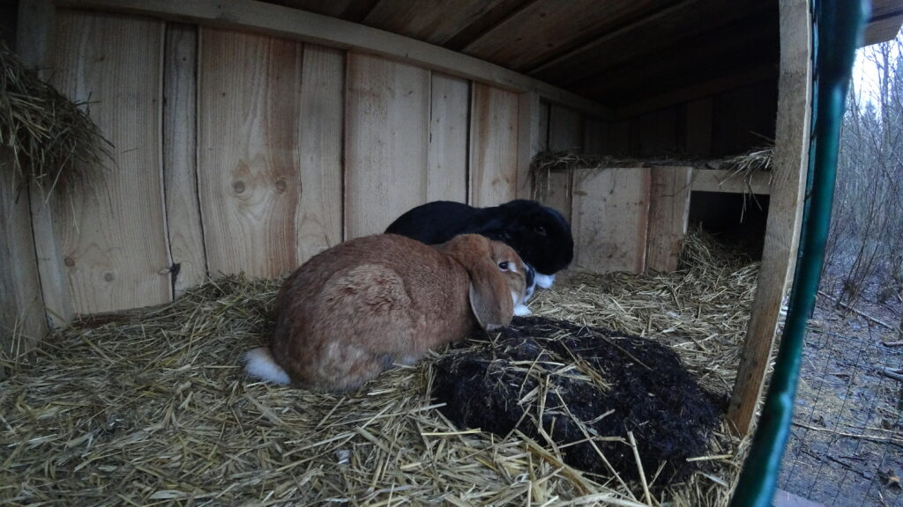

Les petits habitants

## Le poulailler

Nous avons cru au début qu’il s’agissait d’une autre tiny house, mais non! C’est un poulailler. Il doit y avoir une dizaines de poules et un coq. Une serre se trouvait à coté du poulailler, afin de préserver la terre de la neige pendant l’hiver pour permettre aux poules de gratter le sol. Nous y jetions nos déchets alimentaires et les poules faisaient le tri !

Nous avons assisté a une ou deux batailles en coq, c’est assez impressionnant. _On y reconnaît les belles qualités qui ont érigé cet animal en totem français : hargneux, belliqueux, fier et autoritaire ! (à supprimer, je pense :D :D )_

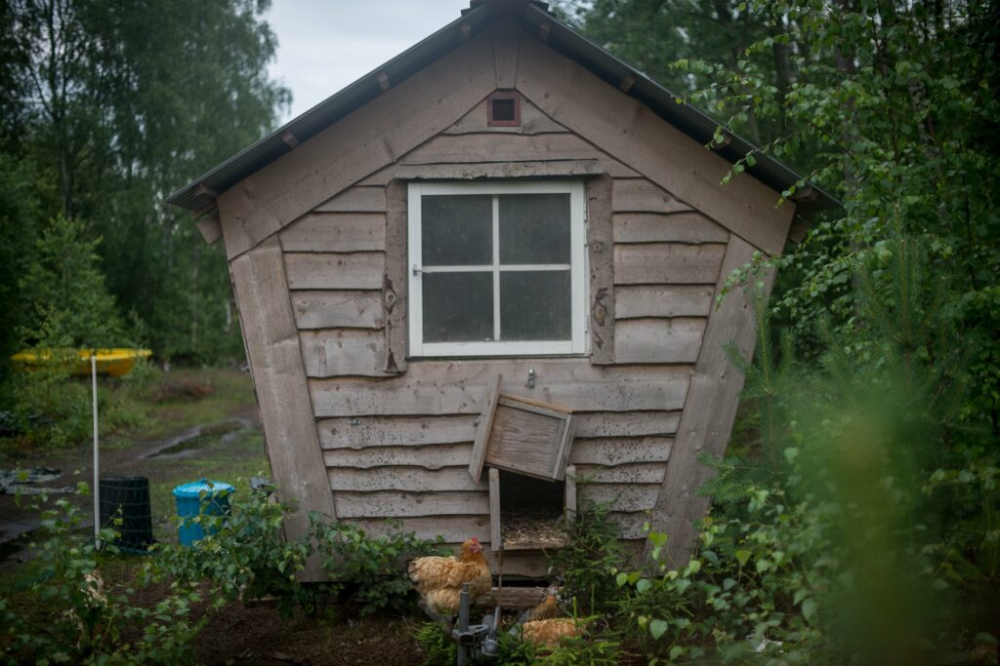

Le poulailler - by David & Eliza

https://youtu.be/TlEzi1twkPA

## La cuisine extérieure

La cuisine extérieure se trouve en face de l’atelier. On y trouve un grand évier double, un four en terre construit au cours d’un atelier organisé par le frère de David, de quoi faire des grillades, des plaques au gaz. Bref, de quoi cuisiner pendant l’été. Nous n’avons pas vraiment pu l’utiliser régulièrement, mais nous pouvons toutefois attester de l’efficacité du four ! Nous y avons fait une cuisson de pizza véganes pour nos hôtes, et Émelyne a pu y cuire une génoise pour son roulé de Noël !

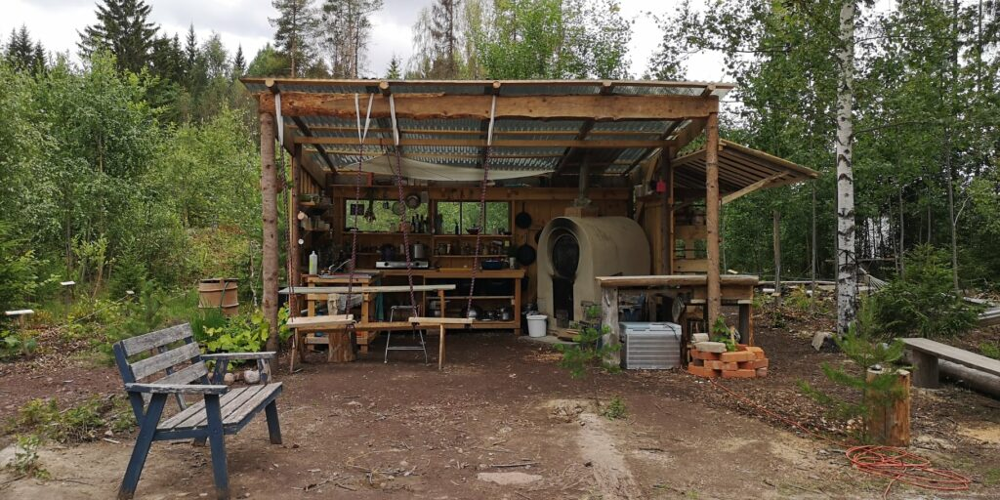

La cuisine extérieure - by David & Eliza

## Le sauna

Nous arrivons au plus agréable, le sauna ! David construit ses sauna sur des remorques. Ça les rend facilement transportables. David nous a raconté qu’Eliza et lui l’emmènent souvent dans les festivals pour en profiter au maximum.

Le sauna a été placé à coté de l’étang des castors afin d’y pouvoir plonger facilement ! C’est tellement agréable ! Sauf pour Emelyne après les premiers gels. Emelyne, en digne casse-cou qu’elle est, a décidé, après avoir vérifié que la glace soit bien cassée, de sauter deux fois plus loin que prévu ! Heureusement, plus de peur que de mal, Emelyne a traversé la glace en n’écopant que de quelques coupures aux tibias.

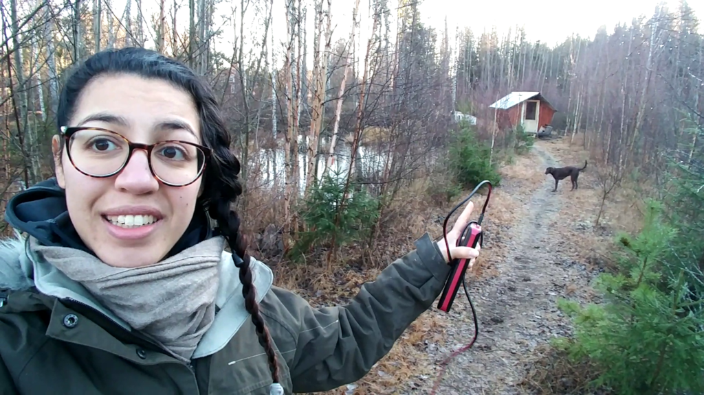

Emelyne nous indique le chemin du sauna !

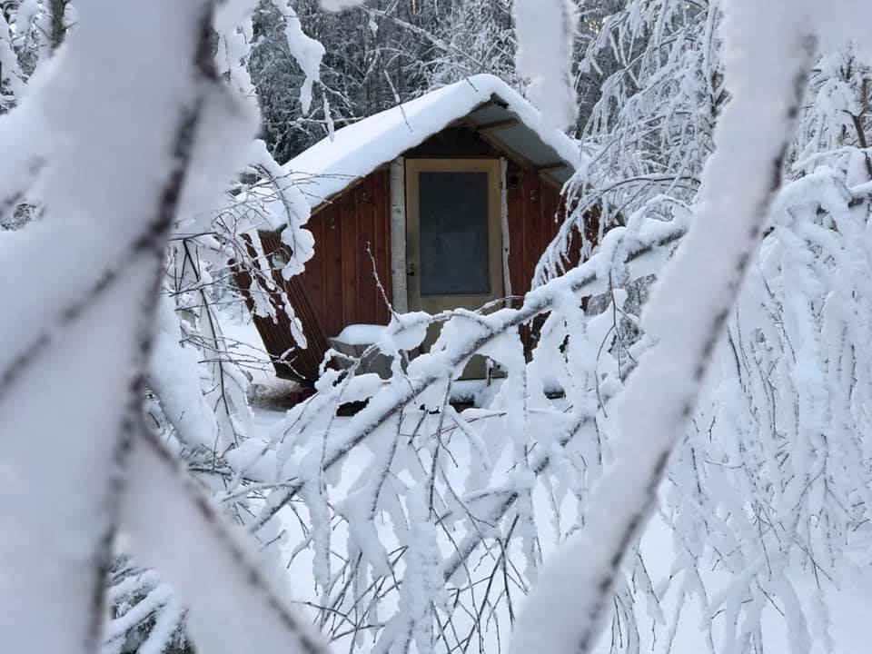

Le même en hiver - by David & Eliza

## La douche d’été

Nous ne l’avons utilisée qu’une ou deux fois avant que les températures ne tombent. La douche d’été se trouve à coté du château d’eau qui redistribue l’eau à la cuisine extérieure. Un tuyau amène l’eau du château dans une cuve métallique sous laquelle on démarre un feu. Une fois l’eau chaude, il nous suffit de tourner le robinet pour avoir une bonne douche brûlante !

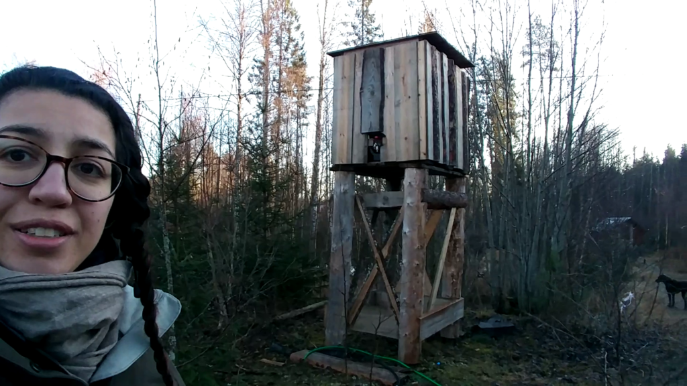

Le beau château d'eau...

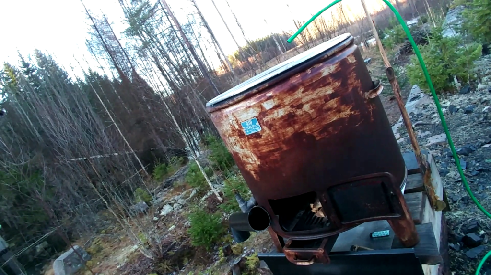

... et la douche d'été.

## Le puits

Le puits fournit toute l’eau potable du terrain. David a isolé le puits en construisant une cabine autour, afin de protéger du gel. Sans chauffage mais avec une bonne isolation, la cabane se maintient seule autour des 4ºC.

Impressionnant quand on sait que l’extérieur est à -15ºC ! David a mis une pompe dans le puits, qui fonctionne sur une batterie 12V. C’est très pratique pour remplir les bidons d’eau rapidement.

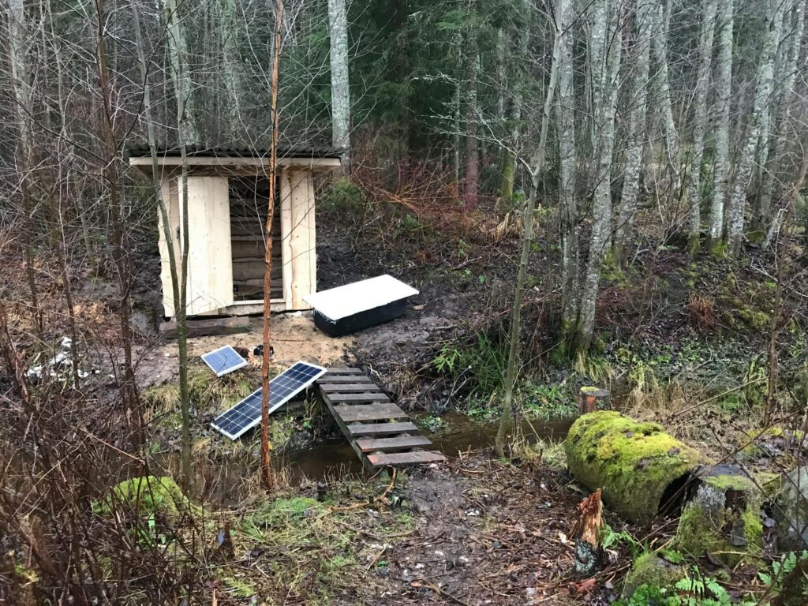

Le puit bien isolé et la baignoire qu'on a pu chauffer par une froide nuit d'hiver !

## Conclusion

Voilà pour le tour du propriétaire. C’est un joli terrain, très allongé mais avec beaucoup de potentiel ! David et Eliza y plantent et greffent beaucoup d’arbres fruitiers, et nous sommes curieux de voir le résultat dans quelques années !

P.S. : Nous n'avons pas pris de photos de toutes les installations (le poulailler, le puit ou le sauna par exemple). Nous avons récupéré quelques photos de David et Eliza sur leur facebook, disponible [ici](https://www.facebook.com/thehumblehabitat/) !
