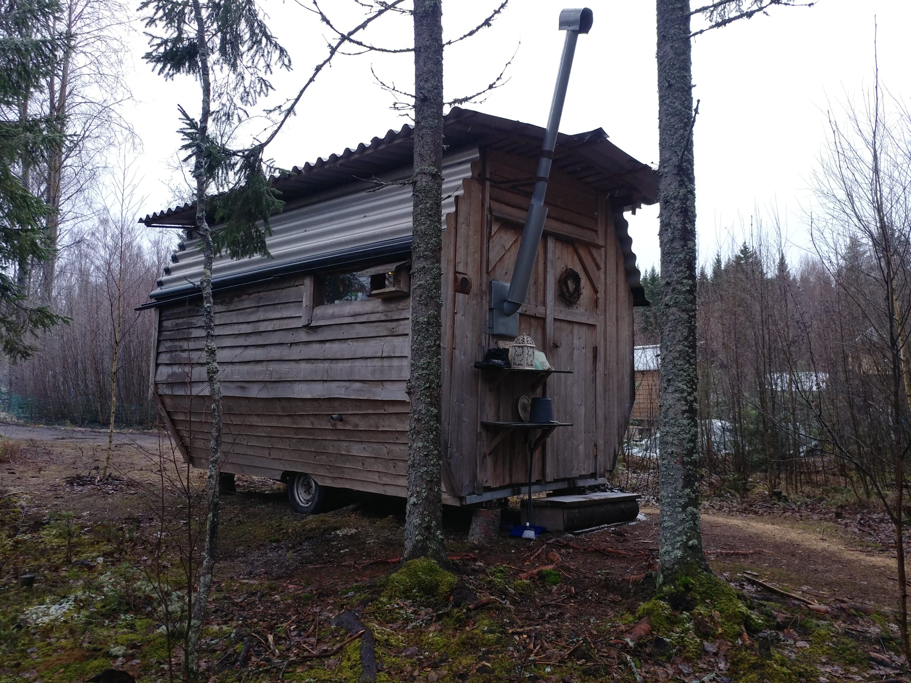
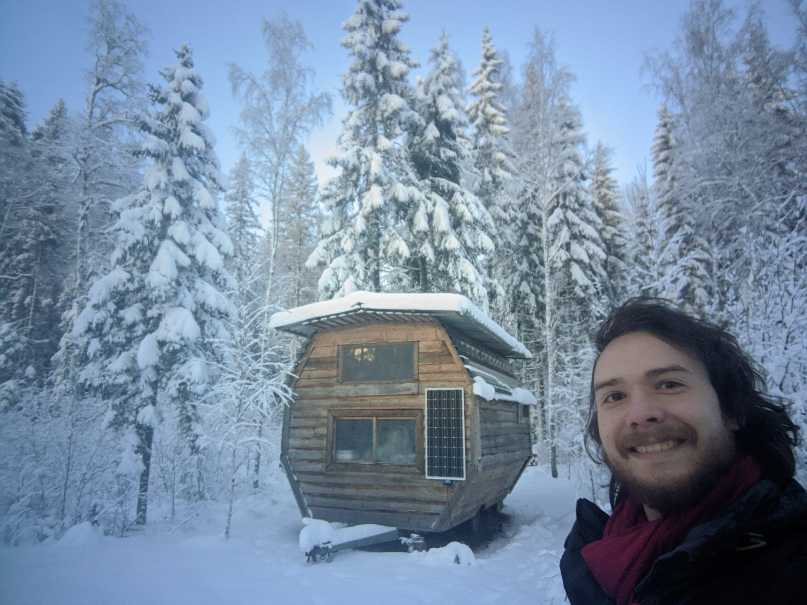
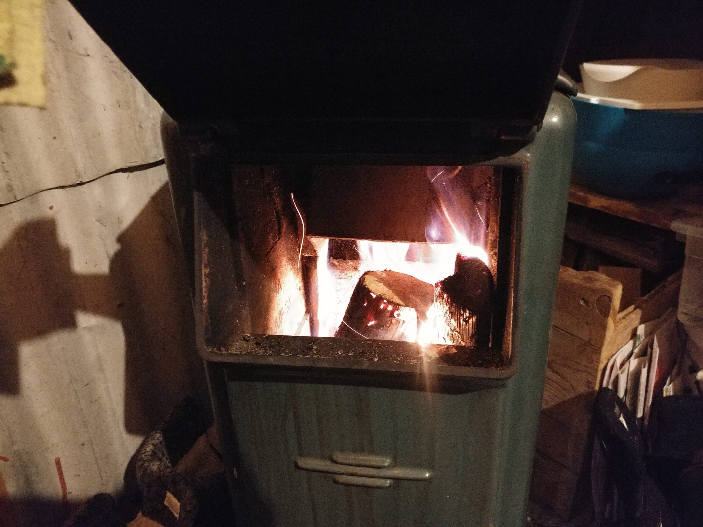
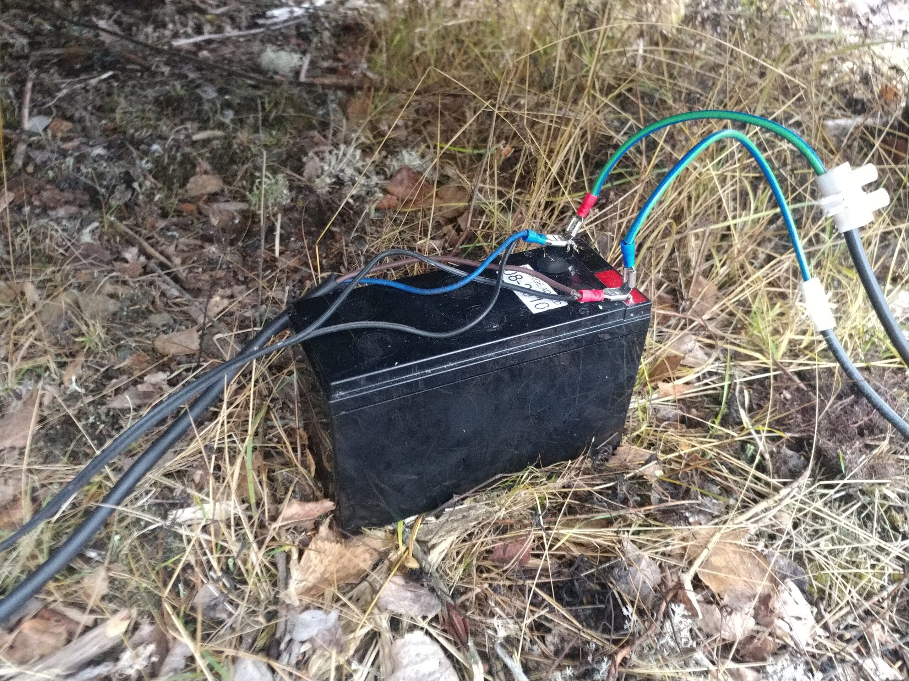
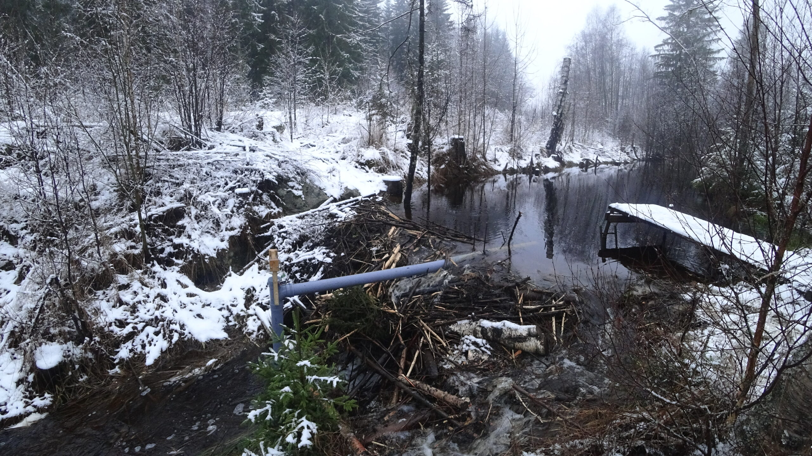
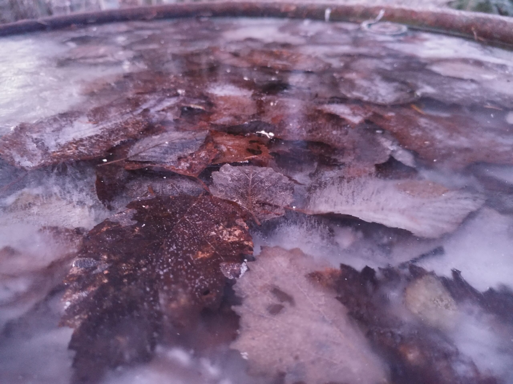
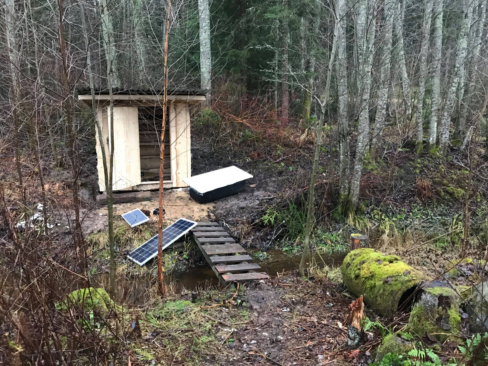
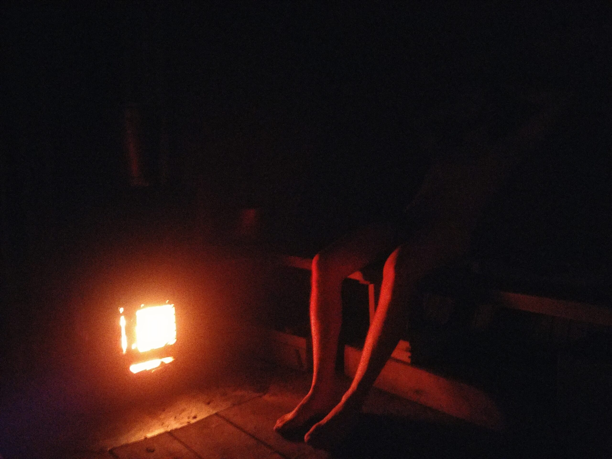
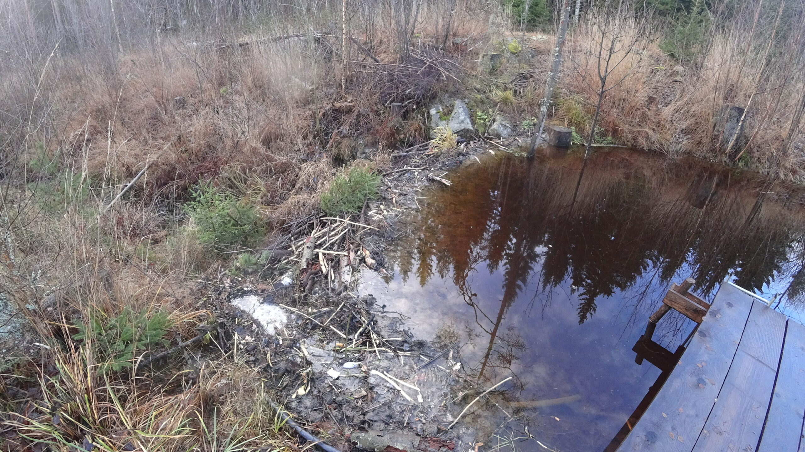
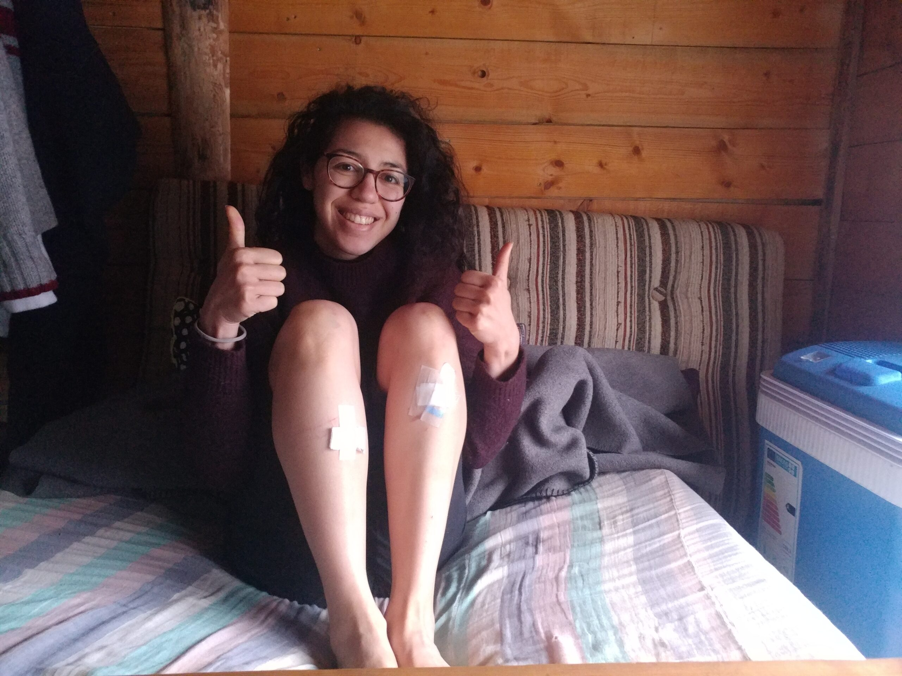

Nous avons découvert à notre arrivée une charmante petite maison dans la forêt, où nous allons passer les trois prochains mois.

La tiny house en automne...

... et la même en hiver !

## Agencement

On n’imagine pas tout ce qui peut tenir dans une si petite surface ! La maison doit faire approximativement 10m2 et on a un poêle avec cheminée, une petite cuisine avec double évier, un coin salon avec une table et deux petits sofas, un grand lit double, un four (non-fonctionnel), une armoire pour ranger et suspendre nos affaires, deux énormes tiroirs et beaucoup d’autres étagères pour le rangement !

Comment est-ce possible ? vous entends-je vous écrier, abasourdis par tant de luxe et de stupre. Mais, c’est bien sûr, l’ingéniosité humaine ! vous réponds-je alors dans un français soigné, dont la tournures des phrases aussi légère que la feuille virevoltant dans l'air humide et boisé de l'automne glisse délicieusement dans vos esgourdes béantes.

L’optimisation, voilà tout ! Le lit est en mezzanine, et les murs de la maisons sont construits en hexagone, permettant ainsi de placer les rangements sur ceux-ci sans consommer de surface au sol. Plutôt pratique !

 
  

## Chauffage

Nous sommes en Suède, et comme on dit là-bas, le bois vous chauffe trois fois ! Une fois en débitant l’arbre, une fois en le transportant, et une dernière fois en le brûlant !  
Le chauffage est apporté par un petit poêle dont la cheminée donne sur le coté de la porte d’entrée. Vu le volume de la tiny house, il n’en faut pas plus pour réchauffer la pièce. Il faut juste prendre en compte l’inertie thermique et savoir que la pièce va mettre un peu de temps à se réchauffer quand on revient d’une journée en extérieur. Autre technique d’appoint : faire la cuisine ! La pièce étant petite, la chaleur dégagée par la cuisson permet parfois de bien se réchauffer, au prix d’un peu de vapeur et d’humidité !

Nous nous sommes aussi aperçu de l’importance de l’isolation. Les températures ont commencé à baisser quelques semaines après notre arrivée, et nous avons commencé à avoir un peu froid avec l’arrivée de la neige. Nous avons décidé d’améliorer l’isolation et sommes partis dans un magasin de seconde main pour acheter des vieilles couvertures et quelques crochets en métal pour une bouchée de pain. Nous avons découpé et cousu les fixations sur la couverture, puis sommes allé chercher des branches dans la forêt pour fabriquer des tringles et suspendre notre création ! Tadam ! De beaux rideaux bien épais pour isoler les ouvertures, portes et fenêtres. Nous avons très vite senti la différence. Vive le « DIY » !

Émelyne et moi avons toutefois dû faire face à deux problèmes, peu gênants au début mais plus visibles sur le long terme.

Premièrement, le bois n’était pas sec. Nos hôtes ne sont arrivés sur le terrain qu’en Avril 2020 soient 8 mois avant notre arrivée. Nous avons mis du temps à le comprendre au vu des constructions qui avaient été réalisées dans un si court laps de temps par une seule personne avec quelques volontaires ! Les hôtes avaient découpé du bois pour notre arrivée mais il n’y a pas eu assez de temps pour qu’il ne sèche. Nous avons donc eu un peu de mal à démarrer nos feux sans enfumer toute la maison ! Nos habits ont pu prendre une douce odeur de feu de bois grâce à ça.

Deuxièmement, le poêle était placé juste à côté de la porte d’entrée. Cette tiny house a été la première construite par notre hôte, avec des matériaux de récupération. Le poêle était un peu trop éloigné de l’endroit où l’on passe le plus de temps dans la maison en hiver, soit le coin salon/lit. La chaleur mettait plus de temps à arriver vers nos endroits de vie, et vue l’isolation de la maison, partait trop rapidement une fois le poêle éteint. Ça a donné lieu à quelques erreurs de gestion de la chaleur avec des soirées à se frigorifier, ou au contraire torses nus transpirants à -10 degrés. :D Nous avons découvert plus tard dans leur nouvelle maison l’existence de petits ventilateurs/radiateurs en métal qui permettent de faire circuler la chaleur, ça aurait pu être une idée pour améliorer le confort dans la tiny house sans utilisation d’électricité. D’ailleurs nous avons pu aussi remarquer que dans la nouvelle version de la « not-so-tiny » house, le poêle était cette fois-ci proche de la pièce de vie !

## Électricité

Nous n’avons pas de raccordement au réseau électrique à Humble Habitat. L’été c’est un ensemble de panneaux photo-voltaïques qui génèrent la grande majorité de l’électricité qui est utilisée pour charger les batteries principales et celles des outils. Le soleil est présent pendant une bonne partie de la journée et de la nuit en Suède !  
Une partie de l’électricité de la tiny house provient des grosses batteries centrales, une autre d’une petite batterie 12V située sous la tiny house. Ce circuit secondaire, auquel sont raccordés notre petite pompe à eau ainsi qu’une série de LED, est chargé par le panneau solaire en été.

Ça se complique en hiver. Les hôtes sont installés récemment et utilisent un générateur thermique pour charger les batteries. Ils le faisaient tourner tous les jours à notre arrivée. L’avantage d’un terrain où les technologies sont plus bas-niveau et compréhensibles, c’est qu’on peut constamment améliorer et bidouiller. David, notre hôte, avait bougé les batteries à l’intérieur de l’atelier pour limiter les déperditions liées aux basses températures et avait mis en place un système de régulation pour ne plus avoir à charger qu’une fois tous les deux-trois jours. Il a aussi construit un prototype fonctionnel de turbine pour profiter du barrage construit par nos amis les castors et ainsi générer du courant hydro-électrique pour l’hiver. Comme disent nos amis anglophones, it’s a work-in-progress.

## Eau

Pas d’eau courante dans la forêt ! Nous fonctionnons en allant cherche l’eau du puits que l’on stocke dans de gros containers. Nous tenions environ une semaine et demie avec 45 litres d’eau potable. C’est sûr que c’est moins que la consommation moyenne de 130l/jour par foyer ! :D La bonne nouvelle est que nous avons une petite pompe actionnée au pied pour tirer l’eau dans le robinet. C’est très pratique pour la vaisselle et remplir nos gourdes !

Cette photo n'a aucun autre interêt que de montrer les talents de photographe d'Émelyne.

Là aussi nous avons trouvé des techniques pour réduire notre consommation d’eau. Il faut savoir qu’au début nous tenions 3 jours avec approximativement la même quantité. Nous avons réduit en utilisant la pluie/neige pour faire la vaisselle aussi souvent que possible, nous faisions la vaisselle en réutilisant l’eau de rinçage comme trempage pour la suivante, et en faisant la vaisselle dans l’évier bouché pour ne pas faire couler trop d’eau. Autre technique pour réduire, nous utilisions un verre d’eau potable pour se laver les dents. Et on faisait chauffer l’eau de pluie/neige pour la toilette personnelle.  
Le plus gros poste d’économie d’eau a été la vaisselle.

Ça pourrait paraître pénible à certains, mais on s’y habitue rapidement. Et nous étions prêts à faire l’effort quand nous savions que l’alternative était de déneiger un sentier de 250 mètres pour accéder au puits. :D

Parlons d’ailleurs de ce puits ! Un petit cours d’eau passe au travers de Humble Habitat. Il faut savoir que comme pas mal d’endroit en Suède, l’eau ne manque pas! C’est d’ailleurs un peu marécageux par endroit. Le puits a été creusé le long du cours d’eau, ce n’est pas le débit qui pose problème! Enfin si, mais pas par le manque. Il y a tellement d’eau que le puits dégorge parfois, et il a fallu créer une petite canalisation pour permettre l’évacuation du surplus. L’eau est rendue potable grâce à diverses couches de cailloux, roches, sables qui filtrent et purifient l’eau. Nos hôtes nous ont informé qu’il fallait souvent quelques mois avant que l’eau ne soit parfaitement potable après la construction d’un puits de ce type. C’est le temps que des micro-organismes s’installent dans le sable et aident à l’élimination des bactéries qui peuvent nuire à l’Homme.

Le fameux puit... quand il n'est pas couvert de neige !

## Hygiène

On touche au plus sensible dans ce mode de vie. Nous n’avons pas d’eau courante ici. Il n’y a pas de soucis quand les températures sont plus chaudes. Les hôtes ont fabriqué un petit château d’eau en bois sur le point le plus haut, et ce château d’eau redistribue l’eau avec la pression naturelle. Cela permet de remplir un tonneau en métal sous lequel on allume un feu et on prend une douche.

La douche d'été !

Mais c’est impossible en hiver pour une simple raison : l’eau gèlerait dans le château d’eau.

Nous avons trouvé les solutions suivantes. Nous réchauffions de l’eau de pluie/de la neige sur le poêle pour la toilette régulière et nous lavions au gant. Il nous fallait une autre solution pour pouvoir se laver les cheveux avec des températures avoisinant les -15ºC. Les castors nous ont donné un coup de pouce ! Ils ont construit un barrage sur le cours d’eau qui traverse le terrain, juste à coté du sauna. Un étang s’y est formé et les hôtes ont construits un petit parcours pour accéder à un ponton au-dessus de la mare. Nous allions donc se réchauffer au sauna, puis marchions jusqu’au ponton. Une fois arrivés, il suffisait de casser la glace avec une hache et nous pouvions plonger dans l’étang ! Nous pouvions nous y savonner pour les plus courageux, ou simplement revenir au sauna où nous avions laissé un seau d’eau chauffer sur les pierres. Il nous suffisait de sortir devant le sauna pour pouvoir se prendre une petite douche chaude au seau ! Ta-dam !

Un camille qui cuit doucement dans le sauna...

... avant de sauter dans le petit bassin généreusement construit par les castors !

Emelyne aussi ! ... Mais elle, c'est à pieds joints à travers la glace !

Ce système fonctionnait, mais il faut avouer que nous avions besoin d’énergie mentale pour pouvoir se laver, ce dont nous ne disposions pas toujours après une journée de travail à l’extérieur.

## Bilan

Nous avons apprécié ces trois mois passés dans la nature. Off-the-grid, comme on dit. Nous avons du nous habituer à une autre vision du temps : nous avions plus de temps libre mais une partie de ce temps libre était utilisé à couper du bois, chercher de l’eau, se réchauffer… C’était agréable, tout passait un peu plus doucement. Nous avons quand même eu quelques frustrations, surtout avec le froid et l’hygiène. Ce sont principalement des détails qui auraient pu être réglés si nous avions voulu nous installer sur le plus long terme : du bois plus sec, un poêle un peu plus conséquent pour ne pas avoir à le relancer constamment, se créer un moyen de garder l’eau chaude/tiède plus longtemps et plus facilement…

Je crois d’ailleurs que c’est ce qui nous a le plus plu à Humble Habitat : si nous voulions améliorer notre confort, nous n’avions qu’à trouver une solution intelligente pour se faire. Et si la solution intelligente n’était finalement pas si intelligente, nous pouvions très facilement l’améliorer. Vivre dans la forêt avec des technologies plus simples devient un univers de possibilités.
