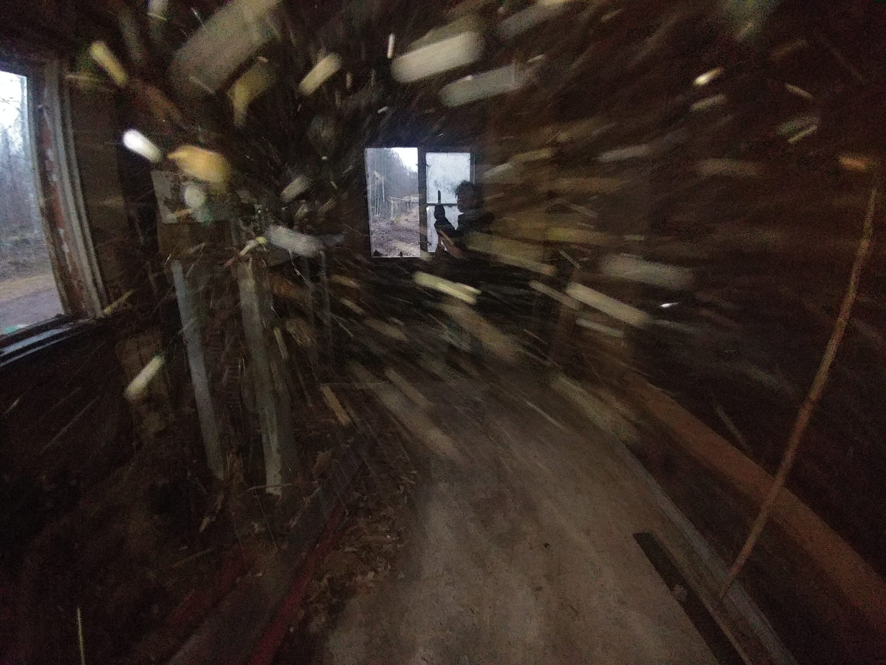

Et oui, il y a une gare à Humble Habitat ! Bon, certes le dernier train est passée il y a 50 ans. Mais qui sait? Peut-être un jour les trains viendront s’arrêter à HumbleHabitat-Gare ?

Emelyne et moi avons décidé de donner une coup de dépoussiérage au petit bâtiment en ruine. Nous y avons soulevé un énorme nuage de poussière, nous n’y voyions plus rien ! Nous avons retiré le revêtement au sol. Bonne surprise, tous les matériaux sont naturels : bois, papier, carton. Camille a commencé a enlever les morceaux de bois pourris sur les murs puis a fini par s’arrêter. Il aurait finit par enlevé les murs eux-mêmes vu l’état de la cabine.

 
  
