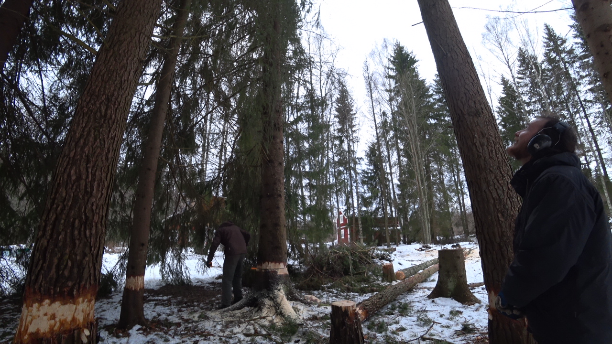
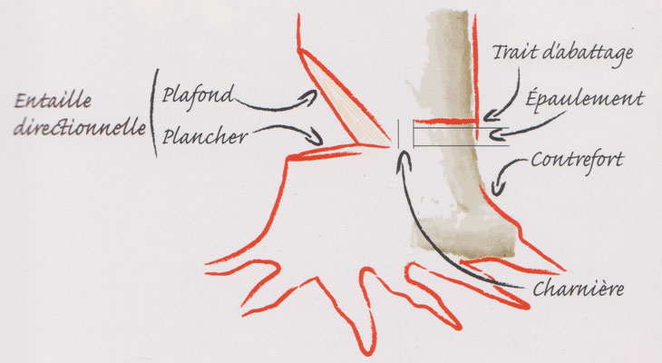
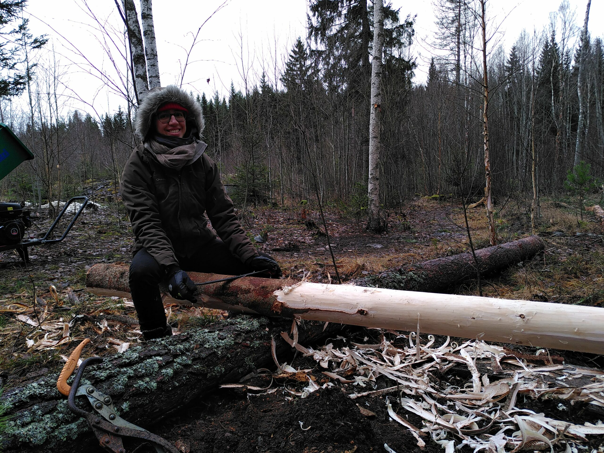
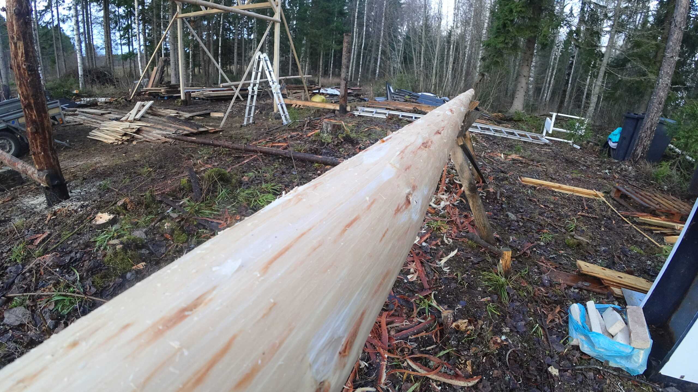

## Séchage

Nous avons appris un technique pour pouvoir faire sécher un arbre avant de l’abattre. C’est utile si nous avons peu de temps pour l’abattage mais que nous savons que nous aurons besoin de bois de chauffage dans quelques mois. Il suffit d’enlever un cercle d’écorce au pied de l’arbre. Si vous enlevez bien l’écorce interne (liber) et externe (suber) sur tout le périmètre de l’arbre, la sève ne peut plus alimenter l’arbre puisqu’elle circule entre l’écorce et le tronc. L’arbre meurt donc et commence à sécher sur pied. Pratique pour ne pas avoir un tronc immense qui gêne sur le sol et pourri en contact avec la terre.

On peut apercevoir les bases écorcées des arbres.

J’ai entendu David et de notre hôte AirBnb à Uppsala parler d’une autre variante permet d’obtenir un bois plus solide. Cette technique est utilisée par exemple pour faire du bois dense pour les tours de fenêtres. Il faut enlever plusieurs pièces d’écorce externe le long de l’arbre, sans jamais créer de zone où la sève ne peut plus monter, au risque de tuer l’arbre comme plus haut. Cette technique forcerait l’arbre à renforcer son écorce interne pour se réparer, et donnerait du bois plus résistant. Je n’ai pas réussi à trouver plus d’infos sur cette technique !

## Abattage

Nous avons pu assister à une démonstration d’abattage par David. La technique suédoise consiste à créer une entaille horizontale, le plancher, dans la direction vers laquelle on souhaite voir l’arbre tomber. La largeur finale de l’entaille doit être environ de 80 % du diamètre du tronc. Nous devons ensuite entailler une seconde fois avec un angle d’au moins 70 % et rejoindre la première, c’est le plafond. Il faut ensuite percer le tronc de part et d’autre pour marquer la fin du trait d’abattage. Nous devons percer quelques centimètres au-dessus de notre entaille, c’est l’épaulement, et laisser une charnière d’au moins 2 centimètres entre l’entaille et cette marque. Il reste enfin à tracer le trait d’abattage à la tronçonneuse. Une fois terminé, nous devons placer des cales dans le trait et utiliser l’huile de coude pour percuter les cales et faire tomber l’arbre !

 
  

La théorie est plutôt simple. La pratique, elle, requiert de l’expérience ! David devait abattre une série d’arbres qui bloquaient la lumière d’un voisin sur sa propriété. Émelyne et mois décidons d’appliquer la théorie que David nous avait enseigné. Pas de chance ! Les arbres avaient poussé si proches que leurs branches étaient entremêlées. Il nous a fallu une énergie incroyable pour les extirper et faire chuter les troncs dans la direction voulue. J’ai d’ailleurs dû utiliser cinq cales pour réussir à faire chuter l’arbre. Mais l’honneur est sauf ! Quand David est passé à son arbre, il a eu le même problème. Pire d’ailleurs, puisque le tronc était plus épais. Nous avons fini par devoir utiliser un immense cric pour s’appuyer contre l’autre arbre et le faire tomber. Après un travail de titan, timber ! L’arbre tombe enfin. Mission accomplie, mais nous avons passé l’après-midi pour abattre et tronçonner deux arbres !

## Débitage

David possède un outil très pratique mais que peu de particuliers ont : une scierie à ruban portative ! C’est un gros engin qui permet de débiter des planches de bois à partir d’un tronc. Après une démonstration de David, Camille s’amuse à essayer la machine !

 
  

## Écorçage

L’écorçage peut être nécessaire suivant l’utilisation que l’on veut faire du bois. Nous pouvons admirer Émelyne en train de chevaucher un pin pour le raser de près !

Il est parfois plus pratique pour les petits gabarits de les positionner sur un cheval.

## Bois de chauffe

L’activité préférée de Camille ! Il a fallu débiter les troncs à la tronçonneuse puis les déplacer avec la remorque vers notre lieu de vie. Une fois dans la grange, nous avons pu commencer le travail de coupe!

Première étape : aiguiser la hache !

 
  

Deuxième étape : couper le bois !

Émelyne nous fait une magnifique démonstration de la chose ! Ça peut paraître bête mais on a vu une sacrée différence de rapidité et d’efficacité de coupe entre notre arrivée et notre départ. Couper du bois n’est pourtant pas compliqué sur le papier : on lève la hache et on laisse tomber ! Mais comme d’habitude, la pratique permet au corps de voir les détails sur l’aspect du bois, les nœuds et autres caractéristiques qui permettent d’aller deux ou trois plus vite ! _Quelque chose qui n’est pas particulièrement mis en valeur dans nos sociétés qui privilégient une certaine forme d’intellect devant toute autre._

 
  

## Éclaircissement des arbres

David est en train de modifier la forêt dans certains emplacements de son terrain afin de favoriser les plantes nourricières pour l’être humain : arbres fruitiers, baies… Émelyne et moi avons dû apprendre à reconnaître les espèces d’arbres en plein hiver, sur des jeunes pousses sans feuilles. Autant dire que ce n’est pas une mince affaire ! Nous avons quand même réussi à nous en sortir et avons fait de la place pour les sorbiers des oiseaux (_S__orbus aucuparia_), avec lesquels David arrive apparemment à greffer des poiriers et des pommiers, les noisetiers (_Corylus avellana_), le merisier à grappes (_Prunus padus_), utile pour greffer des amandes, pêches, cerises, prunes ou abricots.

Le but évidemment n’est pas de supprimer toutes les autres espèces d’arbres. Il faut préserver de la diversité. Même si une espèce n’est pas directement bénéfique pour l’homme, elle l’est souvent pour d’autres espèces animales ou végétales qui aident au maintien de l’écosystème. Les espèces les plus fréquentes sur le terrain de David et Eliza, en dehors des conifères, sont : le bouleau (_Betula pendula_), le saule (_Salix caprea_) et le peuplier tremble (_Populus tremula_). Nous avons laissé des individus à divers stades de croissance. David souhaite améliorer la terre pour permettre aux arbres fruitiers de s’y développer. Les conifères acidifient le sol, et favoriser les arbres à feuilles caduques permet de rétablir un pH du sol plus neutre.

C’est un projet sur le long terme évidemment, l’impact n’est pas si rapide ! En reprenant Didier Barbelavie, laisse le temps à la forêt de red’venir la forêt, et tu verras la forêt, ça n’est rien qu’la forêt !
