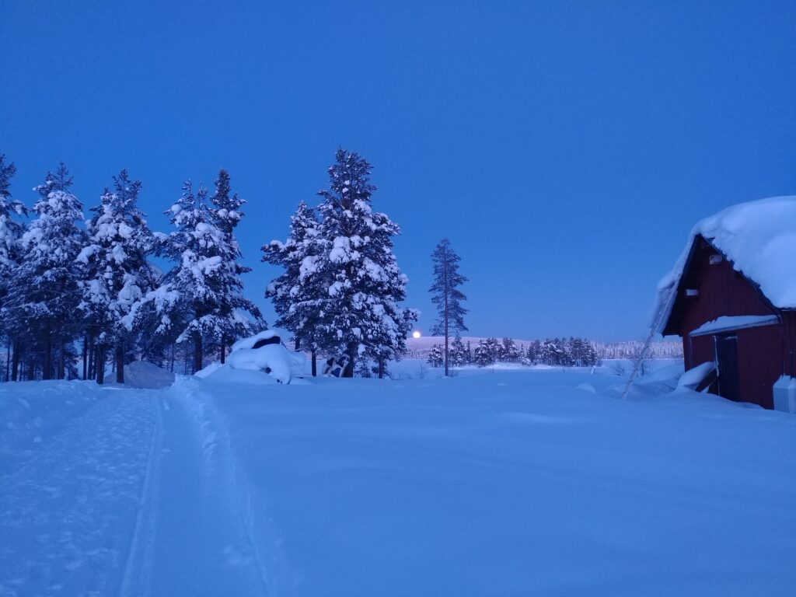
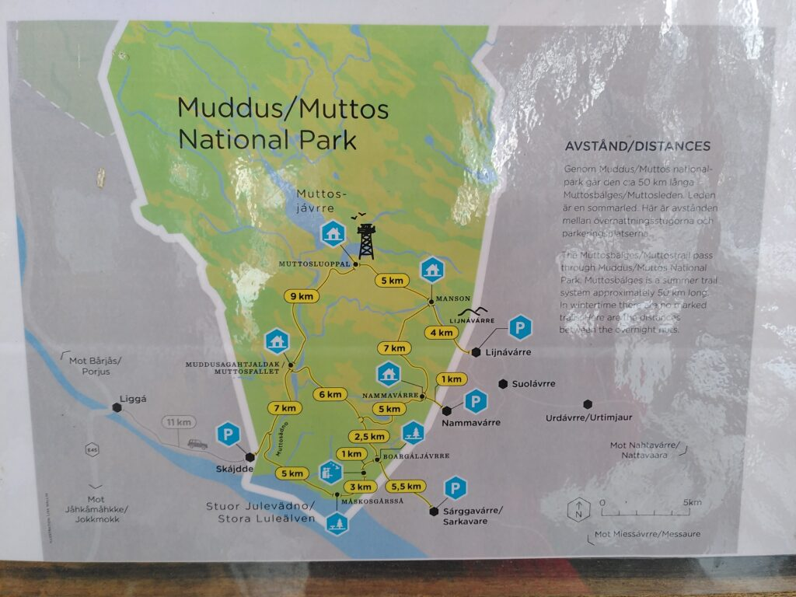
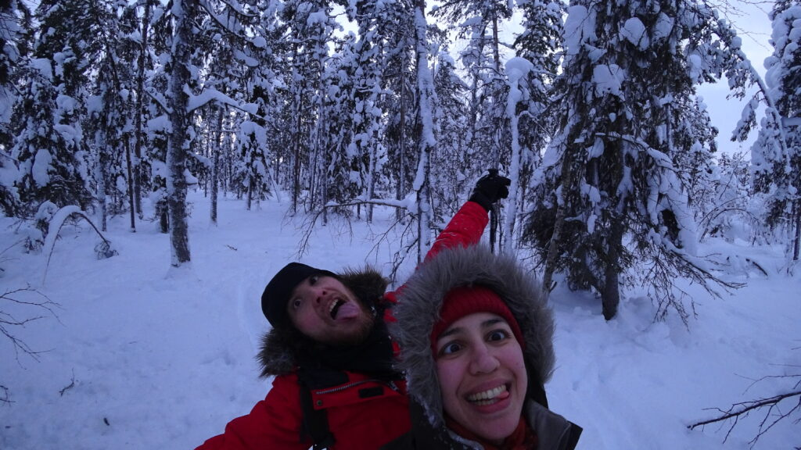

Réveil avec le soleil dans le train couchette.



On a compris qu’on était arrivé en Norrland, ou territoire Sami (et non Laponie car c’est un terme dégradant pour le peuple Sami), quand, à peine sorti du train, nos poils de nez se sont couvert de gel ! Et juste après notre bus s'est retrouvé bloqué par quoi ?... un troupeau de rennes !!!



Nous avons loué une voiture à un particulier qui nous a donné rendez-vous à la station de bus. Nous sommes arrivés et en effet, il y avait la voiture de location, mais personne ! On a attendu quelque minutes, puis on s’est rendu compte que la voiture n’était pas fermée… et les clés étaient dans le pare-soleil ! (comme dans les films !)

On a donc chargé la voiture et on est parti avec en espérant qu’on n'ait volé la voiture de personne ! On imaginait tristement quelqu'un sortir de la station de bus et ne retrouvant pas sa chère voiture ! Haha... Oups?

Que tout le monde se rassure, c’était bien notre voiture de location. C’est quelque chose de récurent, surtout en dehors des grandes villes de Suède : on peut laisser une voiture ouverte, poser un vélo non attaché, une luge… le temps d’une balade et personne le va y toucher ou voler quoi que ce soit. Les gens ont un respect des affaires des autres ! C’est hyper agréable et on ne vit pas dans la peur ! Bon, on ne vous dit pas non plus de laisser quatre jours votre voiture ouverte avec tout votre matériel électronique à l’intérieur ! ;p

On a découvert notre maison pour un mois et ça change des quinze mètres carré de la tiny house ! On a encore un poêle mais beaucoup plus grand et qui ressemble à une statue de l’île de pâque ! Mais le plus important, c’est qu’on a découvert le bois sec !Nous n’avons eu aucun souci pour démarrer le feu, ça change !

Durant la semaine, on a testé la moitié des resto de la ville (pour ceux qui étaient ouverts) et c’est le resto thaï qui gagne haut la main ! La cuisinière est thaï et fait des plats délicieux en quantité déraisonnable ! :D

La ville de Jokkmokk est à taille humaine, on y trouve les commerces « essentiels » : alimentaire, pharmacie, sport, déco, soin du corps (c’est vrai que je n’ai pas fait attention à un magasin de bricolage) et des églises. Il y a même une paroisse ! Ça fait beaucoup pour la taille de la ville, mais il y a la vielle et la nouvelle église !

Dans le coin, c’est la croix rouge qui permet d’avoir de la seconde main. Malheureusement, celle de Jokkmokk est fermée, alors on est parti à Gällivare. C’était l’occasion de découvrir cette ville et celle de Porjus sur le chemin.

Alors Porjus, c’est... vide. Il y a seulement des maisons et une sculpture ! Mais c’est Gällivare qui nous a surpris ! On s’attendait à un petit village, mais en réalité, c’est LA grande ville du coin, et non Jokkmokk dont tout le monde parle ! Du coup, on a redécouvert la ville, mais c’est sûr qu’on préfère la forêt. Et encore, heureusement que la neige embellissait la ville, avec les collines aux alentours qui abritent les stations de ski ! On a profité de la grande ville pour faire tous les magasins de seconde main et trouver des gants chauds pour Camille !

Par contre, dès qu’on sort des villes, on apprécie la blancheur du paysage et les grand pins couvert de neige. Ils sont tellement couverts qu’on dirait de grands bâtons blancs !  
Dans le coin, il y a surtout des collines, mais elles suffisent à donner du relief et à nous enchanter, car à cette période le soleil est bas et donne une lumière de coucher de soleil tout au long de la journée. Avec la neige c’est magnifique car les couleurs orangées se reflètent, ça donne un côté chaleureux.



D’ailleurs, la voiture est indispensable dans ces coins. Chaque ville est séparée par au moins 1h de voiture. Il y a des bus bien sur, mais janvier et février sont des mois morts pour le tourisme. Du coup il y a moins de bus et ils ne vont pas sur les routes peu déneigées. Grâce à la voiture on a donc pu découvrir les parcs nationaux.

Avoir une voiture nous a fait également découvrir la conduite de nuit. Ici, tout le monde (sauf nous) a une barre de phare en plus à l’avant de sa voiture. Ça permet d’avoir une meilleure visibilité car il n’y a pas de lampadaire (seulement dans les villes). Le problème c’est qu’on dirait que les gens compensent quelque chose car c’est la compétition à qui éclairera le plus… C’est assez embêtant car les gens ne se rendent plus compte de la puissance de leurs phares et la moitié du temps ils les éteignent trop tard, nous aveuglent, ou pire oublient de les éteindre. C’est affolant la puissance de ces phares additionnels car on dirait qu’il fait jour en pleine nuit ! Ah c’est sur que vous voyez, mais les autres, eux, ne voient plus rien. Il y a même des fous qui en ont à l’avant et sur le toit de leur voiture !  
Bref, le seul truc fun qu’on peut en tirer c’est qu’au loin, quand une colline nous sépare, on les voit arriver car leur phares surpuissants font un faisceau de lumière vertical vers le ciel et on a l’impression qu'on va croiser un bat-signal pour appeler le héros de Gotham !

La nuit en Norrland pendant l’hiver est aussi l’occasion de voir des aurores boréales ! On a une application qui nous donne des indications et si on se trouve dans la zone des aurores, on sort de la maison pour essayer de les voir !

Du coup, le premier février, nous avons pu observer à travers des nuages de petites traces verte dans le ciel !  
Alors, avec mon appareil photo, j’ai essayé de donner le rendu réel (mettez au max la luminosité de vos écrans pour voir quelque chose !) Avec l’appareil photo de Camille, c’est une autre histoire : là vous vous dites, « ouah c’est hyper coloré ! ». C’est un tout petit un mensonge... Alors, oui, c’est joli, mais on n’a pas eu un vert aussi éclatant cette fois-ci ! Haha peut être une prochaine fois !

Avec toute cette neige, il fallait trouver un moyen de faire des balades sans s’enfoncer dans la neige !

On a pu avoir des skis nordiques gratuits grâce à un système de dons, le Fritidsbanken. Les gens donne du matériel à la ville et on peut l’emprunter pour la durée souhaitée !

On a pu faire nos premiers pas sur des skis nordiques! On les a essayé direct dans a poudreuse à côté de chez nous.  
Verdict : c’est compliqué !  
J’ai pris des ski avec des écailles, donc j’accroche assez dans la neige pour avancer, mais Camille a des skis lisses du coup il n’avance pas, il recule !  Je vous laisse deviner qui a eu le plus de fun ! Le but de notre première sortie était d’atteindre l’enclos des rennes.

Après 2 essais sur les  skis nordiques, des étoiles plein les yeux, on est parti pour le parc national de Muddus ! On voulais aller voir une cascade : Muddusagahtjaldak. Conclusion : c’était sympa, mais compliqué avec nos skis qui glissent (enfin, avec les skis de Camille qui vont à reculons !). On découvrait le chemin tranquillement sur nos skis qui n’étaient pas faits pour les nombreuses montées et descentes à pic ! Après 2 bonnes heures de rando à ski, nous avons déterré une table de pique-nique pour manger. Ça nous a congelé, car nous ne pouvions pas faire de feu… Vu l’heure, nous avons décidé de faire demi tour. La cascade pour une prochaine fois !

 <https://youtu.be/i14c3rFxFjs>

Fatigués, mais contents d’avoir découvert un nouvel endroit, nous avions hâte de rentrer au chaud. C’était sans compter sur Camille qui veut essayer de conduire et de nettoyer le pare-brise en même temps… Nous sommes à peine sortis du parking que la voiture s’est retrouvé dans le monticule de neige du bas côté… Bon pas de stress, on va déneiger. Mais le bas de caisse de la voiture touchait la neige au sol et la voiture étaient inclinée… On a eu beau déneiger, mettre des morceaux de bois sous les roues, tout ce que vous voulez... au bout de deux heures d’essai (la nuit était tombé), il a fallu se résigner à appeler notre hôte pour avoir un numéro de dépanneuse… Finalement il est venu nous aider avec son 4x4. Nos deux heures de galère ont semblées ridicules quand il a tracté notre voiture hors de la neige en deux secondes ! Il n'y a pas de photo, car je n’ai plus eu de batterie à ce moment ! [☹](https://s.w.org/images/core/emoji/13.0.1/svg/2639.svg)

C’est à cette occasion qu’il nous a appris qu’on a souvent le réflexe de freiner quand la voiture glisse, mais il faut en fait accélérer pour permettre aux roues de reprendre de l’accroche ! On a aussi appris qu’on avait de la chance, car à son époque, il n’y avait pas de réseau à Muddus pour appeler quelqu'un au secours !

Quand on n’a pas de tête, on a des jambes !

Une première semaine bien remplie ! On a hâte de la suite !

