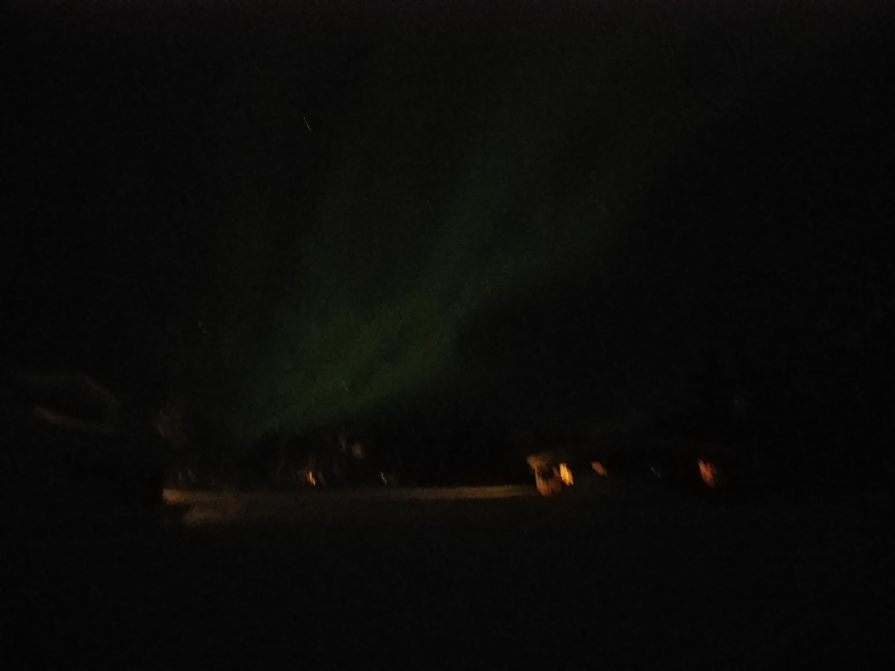
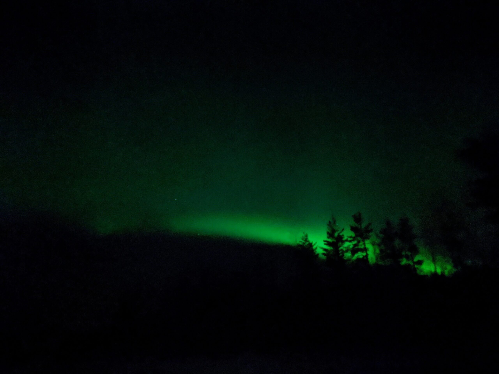
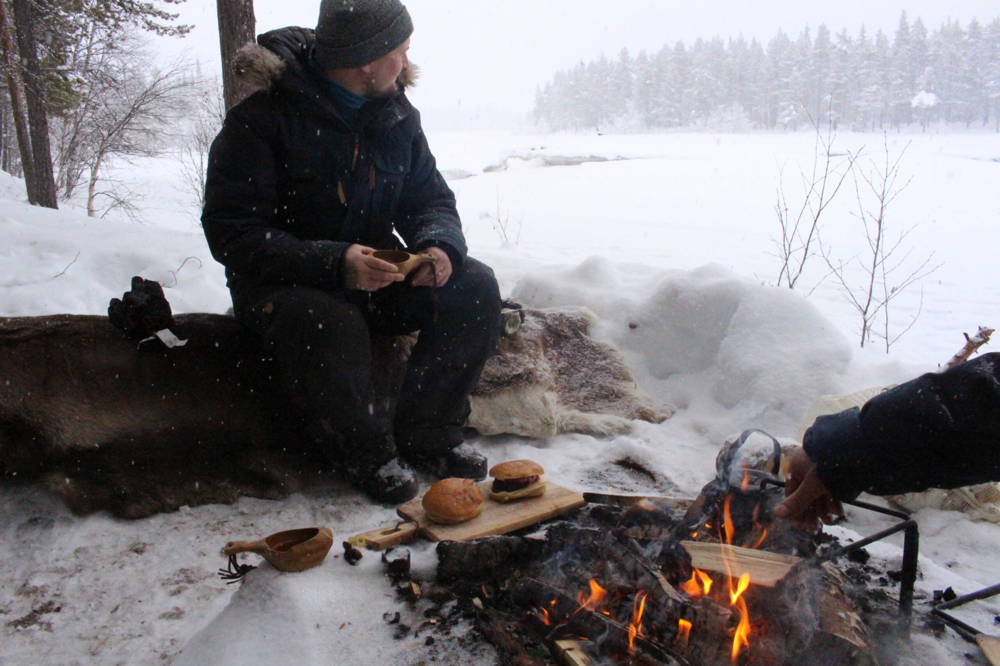

Nous avons eu la visite d’Amaury, le frère de Camille, et de Glenn, un de ses amis ! Ils sont arrivés de nuit et ont pu voir leur premières aurores boréales, et pas des petites !  
On a profité de scintillement orange et violet !

On leur a fait découvrir le sport régional : le ski nordique ! Ah bah, il y a eu des chutes ! x)


  

Mais il fallait un échauffement pour un de nos objectifs de la semaine : dormir dans une cabine au milieu d’un parc national. On visait celui de Muddus et on est parti avec les skis équipés de peau pour éviter que ces derniers ne glissent dans les montées. Mais bon, les peaux ça sert dans les légères montées, pas dans celles à pic ! Du coup, il a souvent fallu quitter les skis pour faire des montées ou des descentes.


  

Sur les sept kilomètres qu’on devait faire avec les skis, on a seulement pu en faire quatre et la nuit allait tomber. On a donc fait demi-tour pour rentrer au chaud à la maison ! La cabine de Muddus sera pour une autre fois, à nous la soirée TV avec une série américaine !

Les gens sont quand même très cool à Jokkmokk : par exemple, la caissière de COOP nous a conseillé de ne pas acheter l’eau en bouteille de son magasin car celle du robinet est nickel !

Ce qu’on savait bien, mais on avait besoin d’un stock pour notre rando. Elle nous a aussi mis en garde sur la neige qui allait tomber dans le week-end et qui aurait pu nous surprendre ! Pas d’inquiétude, on avait vu et on n’y allait pas le week-end !

Par contre, en effet, le week-end, ça na pas été la petite chute de neige... Surtout le dimanche, où on a fait la route jusqu’à l’aéroport. On ne voyait rien ! La neige tombait sans arrêt, la route s'est rapidement couverte de quinze centimètres de neige et chaque voiture croisée soulevait un nuage de neige au travers duquel on ne voyait rien !


  

Du coup, malgré la prudence, on a croisé trois 4x4 d’affilée dans une courbe. Ça n’a pas plu à Camille qui a un peu dévié sur la droite, et on a fait un 180° sur la route ! Plus de fun que de peur ! Les routes sont bordées de neige et donc les voitures glissent seulement et vont se poser dans la neige. On a déneigé le coté de la voiture qui était dans le tas, et les conducteurs des 4x4 qui nous avaient bouchés la vue sont venus avec leur sangles pour nous tracter et nous aider à sortir du tas de neige. C'était l'équipe Bentley de Suède qui allait faire de la conduite sur glace, autant dire qu'ils étaient équipés !

D’ailleurs, ils nous ont dit qu’ils voyageaient tout le temps en groupe pour se tirer de la neige quand un se plantait ! Merci, mais du coup, nous on voit plus rien sur la route !)

Bref, je m’égare. On a également fait un sauna ! Mais à Jokkmokk, pas de saut dans l'eau d'un lac, mais dans la neige ! Alors pour ma part, je trouve ça plus intéressant dans l’eau car on est totalement immergé, mais la neige a un certain charme !

Nos invités ont profité d’une balade en moto neige où ils ont pu admirer des élans et des rennes. Ça a été l'occasion de découvrir la joie d’un feu et d’une grillade en bordure d’un lac gelé. ! 😊

Dans un autre délire culinaire, on a également eu l’occasion de tester la chaine de fast food suédoise : MAX. Bah desolée, mais c’était aussi blasant que McDonald (je leur accorde qu'ils ont des milkshakes vegan vraiment bon !).

En résumé, ce fut une semaine où l'on a redécouvert la langue française, où l'on s’est baladé, où l'on a profité du temps et où l'on a beaucoup mangé !


  
