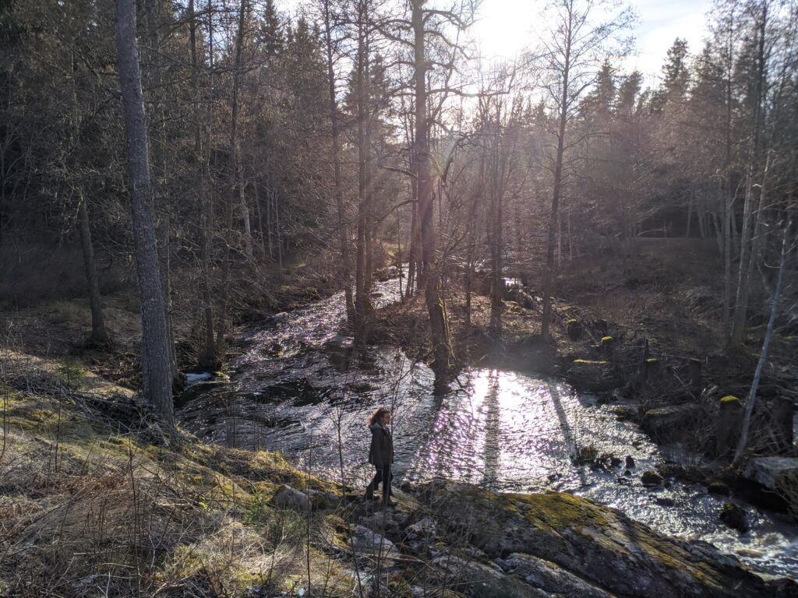
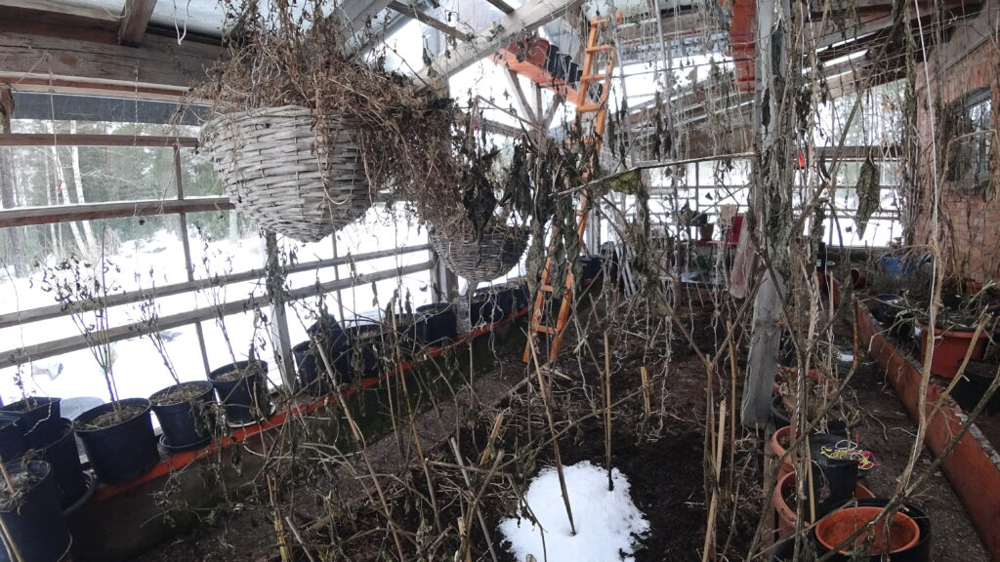
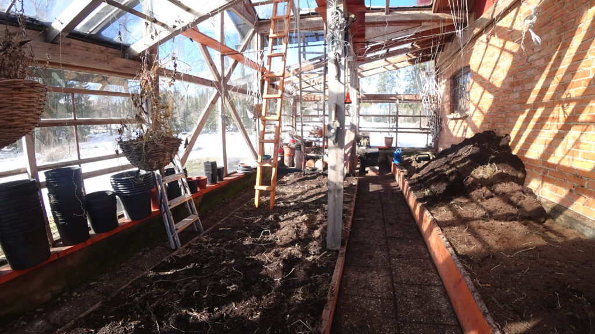
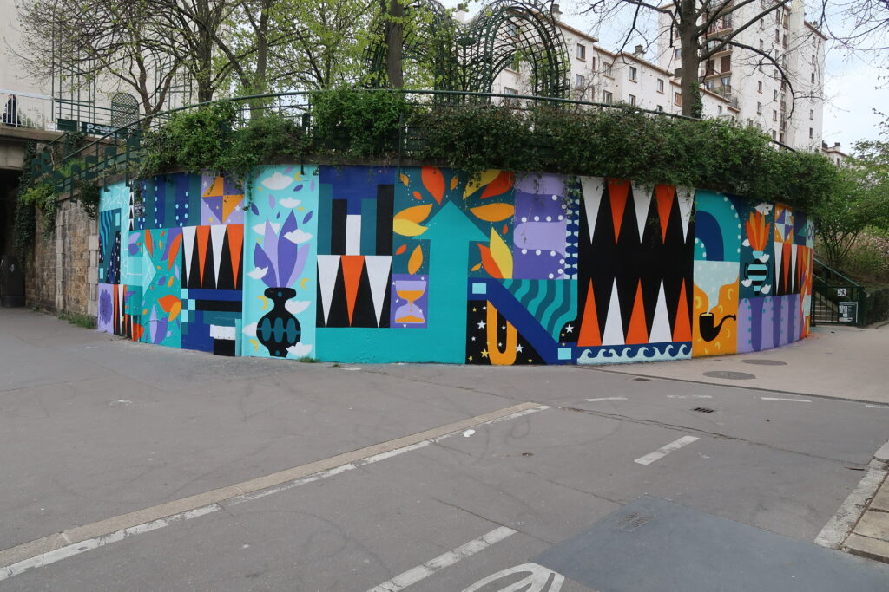

On démarre vraiment notre expérience avec WWOOF et Workaway ! Ce sont des plateformes de volontariat où les gens peuvent d’un côté proposer de l’hébergement en échange d’un coup de main dans leur projet, ou de l’autre proposer leur aide à des endroits qui en ont besoin !

### Tim et Nina

Arrivée chez Tim et Nina à coté d’Arvika !

Pas mal comme environnement !

Notre première expérience est d’aider Tim et Nina, qui ont un terrain depuis environ quarante ans. Ils ont rénové l’entièreté de leur maison et ont créé leur potager et aménagé tout le terrain. Ils ont tenu deux restaurants végétariens dans la ville voisine d’Arvika et monté une boite pour accompagner les gens dans leur vie, que ce soit au niveau santé, régime alimentaire, bien-être, etc.

Premières impressions : le terrain est magnifique et nous dormons dans un cottage de rêve ! On voit vraiment que Tim et Nina apportent de l’importance à l’esthétique du lieu et au confort de vie. Tant mieux pour nous ! Et c’est vrai que c’est un changement bien agréable après la survie dans la forêt ! :D

Après, on aime tellement la neige qu’on leur a ramené de Norrland ! Un ou deux jours après notre arrivé, il y a eu une forte tombée de neige, plus que durant tout leur hiver ! Cela nous a permis de voir le tracteur de Tim en marche pour déneiger !

### Construction d’un plancher dans la grange

Un de nos gros projets de ces quelques semaines a été de construire un plancher pour la mezzanine de la grange. Il faut bien que Frey, le petit-fils de Tim, puisse y conduire son beau tracteur bleu ! On ne part pas de zéro puisque Tim a déjà placé de belles poutres de support et fait une grosse partie de l’isolation du sol.

La construction se fait avec des matériaux naturels, principalement dérivés du bois. Et des vis, bien entendu ! :D On découpe, taille, place, colle, et visse afin d’arriver au résultat attendu ! Nous avons réussi à finir la veille de notre départ ! Pas trop tôt ! Il faut avouer que la philosophie est plutôt de faire plein de projets différents en même temps suivant notre humeur, plutôt que de se forcer à finir rapidement un seul. Tant mieux pour nous, la variété, c’est le sel de la vie !

### Nettoyage et préparation de la serre à tomates

Tim et Nina font pousser de belles tomates pour en profiter l’été ! Mais la serre a été laissé en état après la dernière saison, il va falloir dépoussiérer, astiquer, nettoyer, la casa toujours pimpant !

On fait le tri entre les plantes à récupérer et celles à composter, puis on arrache les plants de tomates desséchés qui s’accrochent encore à leurs lianes ! Erreur tactique : nous ne portions pas de masque pendant notre première après-midi de nettoyage ! Après une soirée à tousser tous les spores et la moisissure ingérée, nous décidons d’en mettre pour continuer. Ça va mieux !

On poursuit en vidant les pots de terre pour faire un beau tas qui finira dans un autre des projets que nous avons réalisé. Balayage, astiquage, gesticulations diverses et variées pour atteindre les hauteurs de la serre, et nous voilà avec un beau bâtiment tout propre ! Ce sont les tomates qui seront heureuses !

### Feux de joie

Là, on parle d’un boulot sympa ! Tim et Nina ont eu une infestation de larves qui ont attaquées les pins derrière leur grange. Il leur a fallu abattre un grand nombre d’arbres. Ils ont entassé les branches et les troncs qui sont à sécher depuis plusieurs mois. Nous profitons du fait qu’il y a eu une grosse chute de neige, pour l’humidité, et de l’absence de vent, pour faire une belle flambée !

Il nous a fallu deux jours et deux nuits pour brûler les quatre immenses tas. Ce fut un beau spectacle, et il y a du travail pour bien tout faire brûler !

### Le potager

Nous avons pu profiter d’un des potagers de Tim et Nina en enlevant les feuilles mortes des fraisiers. Ce fut l’occasion de découvrir la faune et la flore des sols riches du terrain de Tim et Nina !

Nous avons aussi poncé et enduit d’huile des morceaux de bois qui serviront à construire une plantation surélevée dans le potager. C’est Emelyne qui s’est chargée de la construction et de l’assemblage avec Tim ! On les entendait rire de loin ! Nous y avons déversé la terre de la serre à tomates pour terminer le travail !

### Divers

Nous avons fait d’autre menus travaux, comme étaler le gravier qui se retrouve déporté par le déneigement, couper du bois avec une machine (c’est de la triche !), etc.

### La vie chez Tim et Nina

L’attention au détail se retrouve partout ! Il y a vraiment une recherche du confort de vie chez eux. Nous faisons la cuisine ensemble, nous mangeons de délicieux plats, nous écoutons Tim et Nina jouer de la guitare ou chanter. Julia, leur fille, jouer du piano ou nous montrer ses œuvres de street art (JuliaRioRio sur Instagram !). D’ailleurs, le hasard de la vie nous a offert une belle surprise : Julia a peint le mur 12 qui se trouve à côté de notre appartement parisien et c’est une œuvre que nous avions vu avant qu’elle ne disparaisse !

Street art - Julia Rio sur le MUR 12 \[©Juliario\]

Nous apprécions également le sauna qui se trouve face au lac, sur lequel nous avons pu nous prendre pour Pocahontas (ou Titanic suivant les parties gelées) grâce aux canoës !

Un beau séjour où nous avons pu découvrir un bout des environ qui s’apparentent à Fontainebleau mais à la place du sable, il y a de l’eau !!!

Merci encore à eux de nous avoir accueilli dans la famille !
