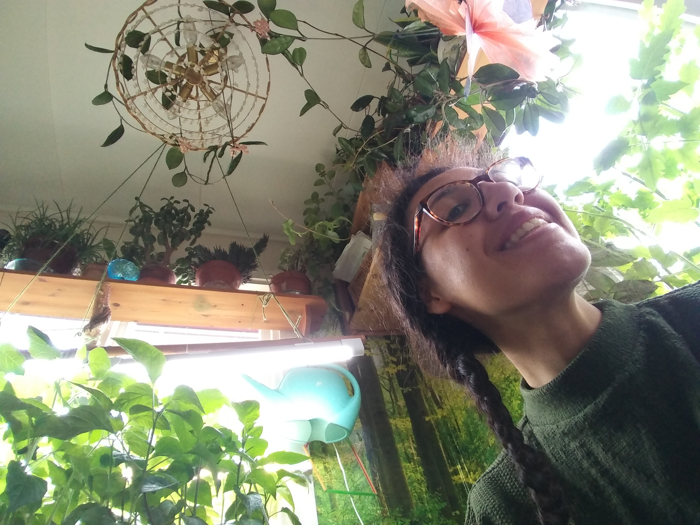
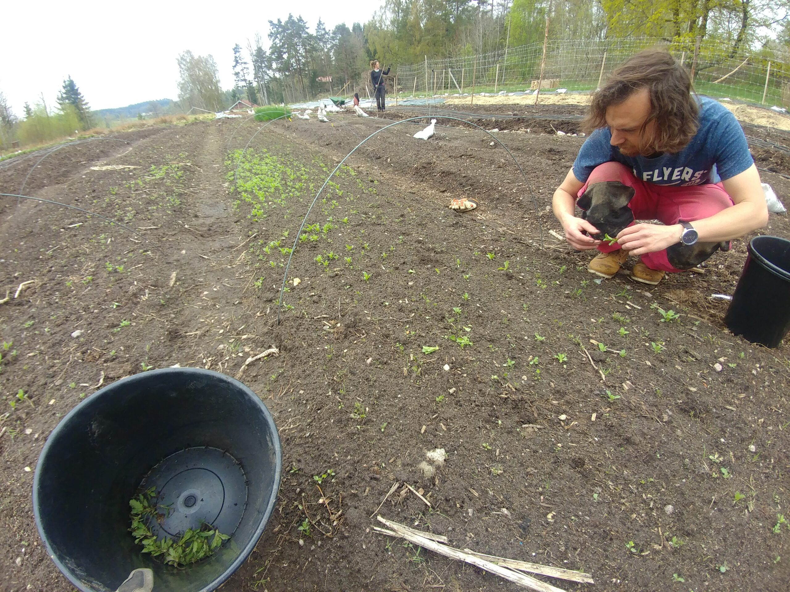
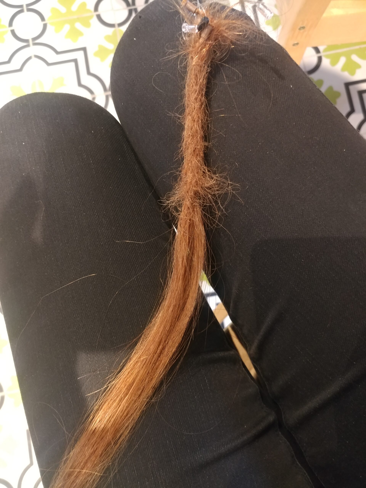
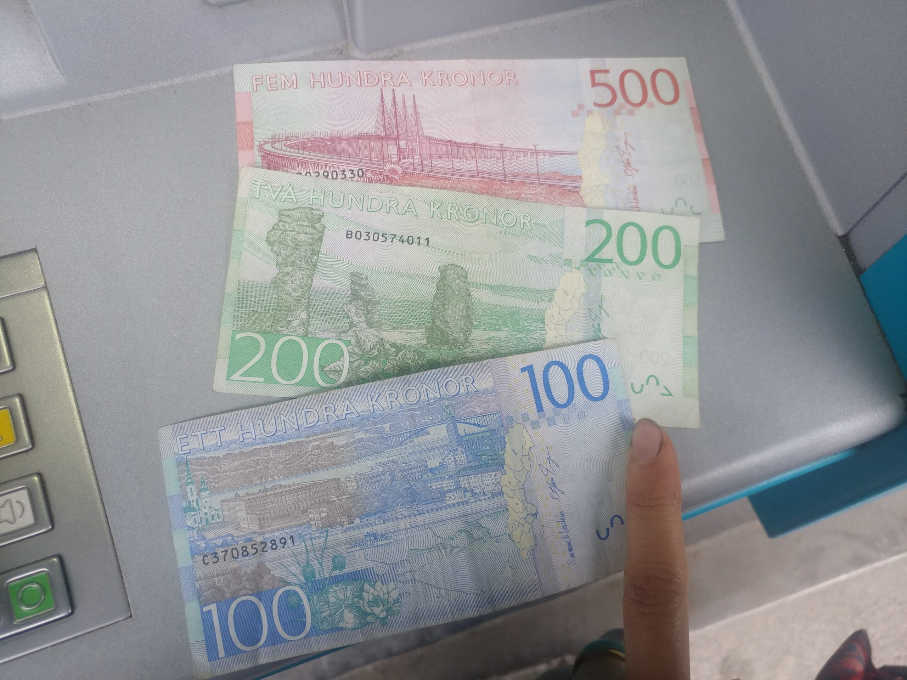
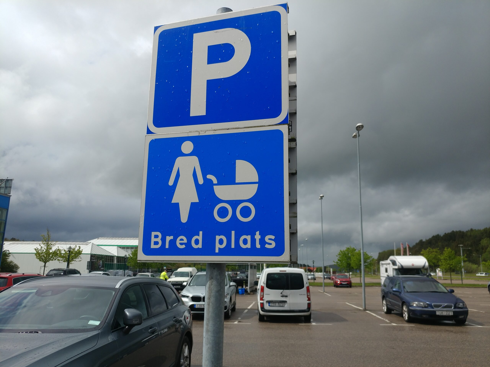
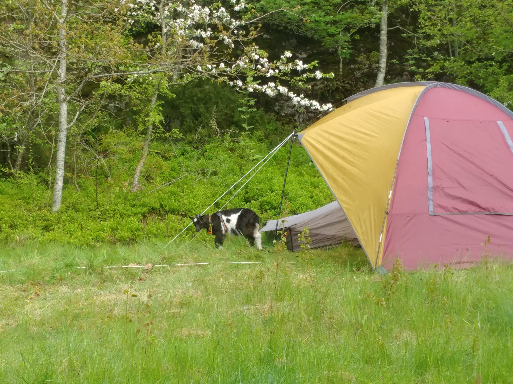
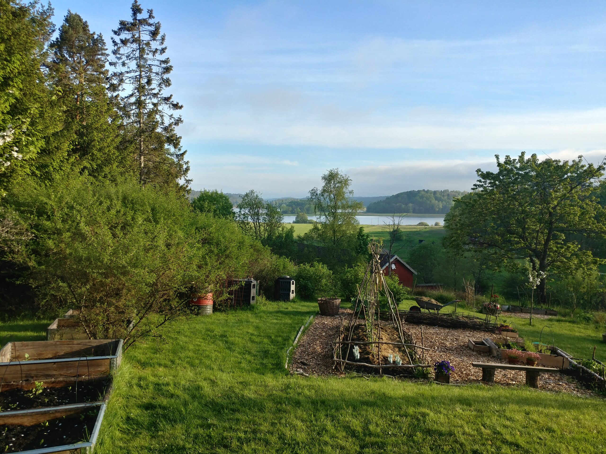
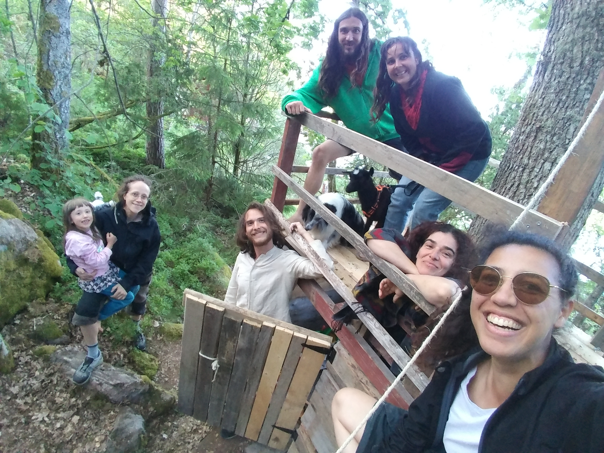

_Ça y est, vous savez enfin ou nous sommes en temps réel ! (enfin, presque, le temps est encore passé trop vite, on part le 17 juin ! 😜)_

Petit voyage en train qui nous a fait traverser le pays d’est en ouest et nous avons découvert la très belle île d’Orust. De la forêt qui pousse sur un rocher !

Nous sommes accueillis par Marie la française et Annika la suédoise. Nous voilà dans notre premier écovillage qui existe depuis une douzaine d’années. La plupart des habitations sont autour d’un grand jardin forêt que les habitants partagent et entretiennent. Ce jardin est enclavé dans un creux et en pente ce qui lui confère un micro climat. Par exemple il y pousse un amandier, plante qui ne se trouve pas usuellement en Suède !

Le printemps vient enfin et nous avons vu les arbres dévêtus se couvrir de jours en jours de leur robe verte.

### Faut bien que ça bosse des volontaires

Il faut nous loger, alors une de nos toute première mission a été de nous aménager un coin dodo !

Le stuga (= châlet) servait de débarras. On a tout vidé pour réorganiser et voilà un coin dodo cocooning !

Tous les 15 jours, les habitants du village et des voisins intéressés viennent le dimanche s’occuper du jardin forêt. Nous avons aidé à déplacer la consoude et la couvrir !

La cuisine d’Annika est une jungle de plants de tomate, il est temps que nous construisions la serre pour les accueillir.

Emelyne dans la jungle cuisine !

Annika avait une grande serre, mais celle-ci ne s’adapte pas sur les terrains en pente. Du coup, nous avons réalisé la construction avec seulement des matériaux de récupération : arceaux en tige filetée, renforcés avec des pieux de genévrier puis réutilisation de tube et de la bâche de l’ancienne serre.

Ça a été beaucoup de boulot, mais on voulait faire quelque chose de solide pour résister au vent et autres tempêtes de fin d’année. On ne sera plus là pour voir ça, mais si ça tombe, on aura un mauvais souvenir de nous ! ;p

En parallèle de la construction de la serre, nous travaillons au jardin d’une voisine tous les jeudis ! On a planté des patates, des oignons, des choux, ajouté de l’engrais et on a également aidé à la réparation de leur maison qui est entièrement en paille et argile !

Travail au jardin !

C’est une belle expérience de travailler sur ce terrain. Nous avons le coucou des canards et des cochons de temps en temps ! D’ailleurs, des bébés canard sont nés juste avant notre arrivée ! ❤️

A la ferme !

Ah oui, nous avons des chiennes maintenant ! Ce sont celles d’Annika, Mammouth est la maman de Ginko. Mammut n’a pas peur des caresses, mais Ginko est très peureuse. Mais au fur et à mesure des balades, elle s’est faite à nous! ? Merci les friandises ! 😜

On est très heureux car Annika a beaucoup de contacts et nous en fait profiter dès qu’elle en a l’occasion. Nous allons voir différentes personnes qui ont construit leurs maisons avec des techniques variée, qui expérimentent des modes de vie alternatifs, ou plus en lien avec leur environnement proche.

Marie, notre hôte française, a également besoin d’aide pour continuer l’aménagement de son terrain. Du coup, armons-nous de nos bêches, il y a des fondations à creuser !

On a tellement bien creusé que la terrasse a été montée rapidement ! Du coup, nous sommes devenus les creuseurs attitrés et nous avons bêché dans tout le village ! Nous avons même commencé la terrasse dans le grand jardin commun et ce, de manière très professionnelle !

Ah oui, Annika veut se faire des dreadlocks et a besoin d’aide, du coup j’apprends à en faire !

Faut que ça crèpe bien !

### Days off

On a des jours de repos bien définis et on en profite pour découvrir les alentours en vélo et parfois en voiture !

On a fait l’ouverture d’un glacier local qui a du succès et on comprend une fois qu’on goûte leurs glaces vegan !

A vélo, on évite au maximum les routes. Du coup on s’est paumé en forêt la dernière fois, et on s’est retrouvé dans les marais à pousser nos vélos ! Il y en a qui profite de la forêt pour aller se percher !

Malgré les embûches, c’est toujours vraiment joli ! Mais on est également tombé sur un drôle de chemin… magie, fétichisme ? Je vous laisse vous faire votre avis !

La mer du nord n’a rien à envier aux autres car elle est transparente, quoiqu’il lui manque peut-être quelques degrés… Il faut être motivés pour s’y baigner ! Je blague, l’été est bien arrivé en Suède et il fait assez chaud pour que les baigneurs soient nombreux !

Toujours ces paysages de ruisseaux, petites cascades, et forêts d’un vert vivifiant accolées à de grands rochers !

Ah oui, on paie toujours en carte bleu, mais pour la 1ère fois, on fréquente des établissements de seconde main qui ne prennent pas la carte. Du coup, j’ai retiré des sous pour la 1ère fois ! J’en profite donc pour vous montrer ce à quoi ressemble la monnaie locale !

Fric, fric, fric !

En parlant de local, voici ce que l’on peut voir sur les parking !

Il donne envi de rester ce pays !

### De nouveaux arrivants

Un matin, je me réveille et voici ce que je vois à ma fenêtre !

Une chèvre ?! (qui fait du camping en plus !?)

Deux nouveaux volontaires sont arrivés : Florine et David, accompagné de Freyja la chèvre suédoise et de Pirate, le chien méga cool !

Du coup, on s’est fait viré de notre petit stuga ! Mais on a gagné au change sur la vue !

Petite vue sur le lac !

Il y a désormais plus de mains pour travailler et on s’est mis à déplacer la forêt !

Ah oui, et du coup, on creuse beaucoup plus vite !!! En 1h, on a déterré 5-6 buissons de baies ! Et il ne fallait trainer pour les replanter !

Florine et David ont une voiture et nous avons passé nos jours de repos en commun à découvrir Orust ! C’est une île qui cache des trésors de paysages !

Ah… dans nos expéditions, nous avons découvert le plongeoir de Mollösund.

Ce dernier permet de sauter depuis 8 m de hauteur ! Bien sûr, aventurière comme est Emelyne, elle a sauté directement depuis le plus haut et avec Géraldine dans les mains ! Bah, c’était super cool, mais le choc a été tellement surprenant que la caméra lui a échappé des mains !... Du coup, malgré des plongées en apnée dignes des profondeurs du grand bleu, nous avons perdu Géraldine… Elle repose dans les profondeurs avec une belle vue sur les bancs de poissons et les méduses…

La troupe de volontaire a une bonne dynamique et tout le monde profite de cette année pour apprendre de la musique ! Du coup, nous avons organisé un concert amateur. Ce fut un moment enchanteur pour tout le monde !

Utsikten Ekoby nous laissera un beau souvenir. Ce fut une expérience très enrichissante et très intense. Nous avons rencontré énormément de personnes plus passionnantes les unes que les autres, la plupart des femmes de tous âges et dynamiques, de 5 à 88 ans, nous avons vu des endroits incroyables et plein de modes de vie. Bref, tout ce qu’on voulait faire en Suède ! Merci encore à tous pour ces moments géniaux, des fikas aux repas partagés (mention spéciale à tous les efforts et le plaisir que les gens du village ont eu à cuisiner vegan pour et avec nous !), en passant par le concert improvisé ou les journées à se balader avec la chèvre sur des belles iles de la côte ouest.

Marie et Annika ont partagé beaucoup avec nous. Nous avons eu l’occasion de bien nous amuser avec leurs enfants, Viggo et Vendela qui sont plein.e.s de vie et d’énergie ! Merci pour la salade banane ciboulette ! Nous sommes fièr.e.s d’avoir participé.e.s à la construction et au développement de leur terrain et du village et nous pouvons que conseiller cet endroit pour une visite merveilleuse !

Merci à Viggo de nous avoir prêté sa cabane !
