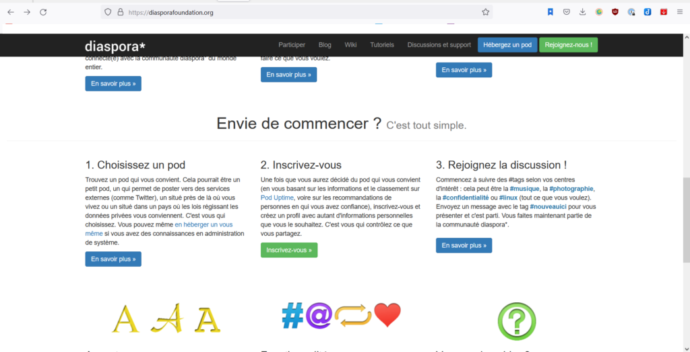
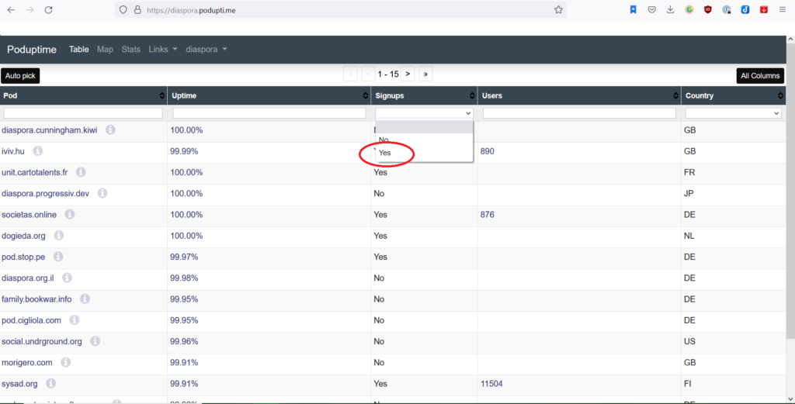
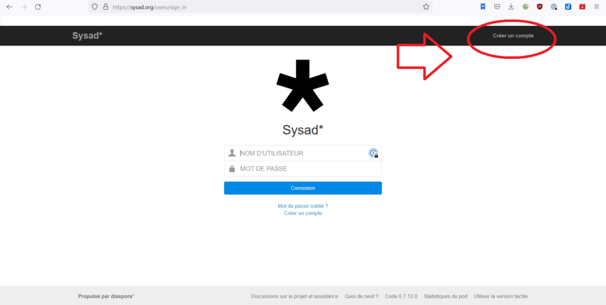
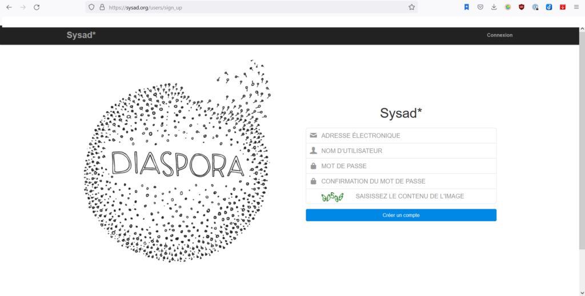

Bien le bonjour à ceux qui jettent toujours un œil au blog alors que nous sommes de mauvais blogueur.euse.s !😅  
Merci encore de votre intérêt pour nous 😘

Il reste 2 articles à paraître,  mais je ne peux vous garantir leur sortie prochaine...  
En attendant, vous pouvez suivre notre aventure en vélo sur diaspora où il est plus facile pour Emelyne de faire plus fréquemment des posts et pour vous de commenter.  

## Qu'est ce que diaspora ?

Diaspora est un réseau social qui s'apparente à Facebook, mais décentralisé, sans avoir les données du monde entier concentrées à un seul endroit.

## Comment ça marche?

Vous pouvez aller sur le site diaspora diasporafoundation.org  

Et vous pouvez suivre les instructions.

En bref, il faut choisir un serveur où vos données seront stockées = un pod.  
Vous choisissez ce pod suivant vos critères (pays, nombre d'utilisateur, compagnie que vous aimez bien...)  
Conseil : sélectionnez les pods qui acceptent les nouveaux venu.e.s en sélectionnant "yes" dans "signup"  

Si vous ne savez que choisir, je vous propose celui sur lequel je suis (s'ils acceptent encore des nouveaux) : Sysad.  
Vous suivez ce lien : sysad.org/users/sign\_in  
et cliquez sur "créer un nouveau compte".

Vous n'avez plus qu'à remplir les champs et suivre les indications.

Conseil: une fois le compte créé, allez dans les paramètres où il y à un encart "notification par mail".  Décochez TOUS les encarts pour ne pas vous faire harceler de mails (au cas où vous deveniez des accros des réseaux sociaux 😂 ) et cliquez sur "modifier" pour que ça enregistre. 😉

Pour nous trouver et recevoir nos posts diaspora: vous tapez dans la barre de recherche : Mabel\_and\_Dandinou et il devrait proposer mon compte. c'est une photo de moi et Camille avec des lunettes de soleil, un lac, et un ponton en fond. 😉  
Cliquez sur notre profil et suivez nous!

Sinon vous pouvez aussi nous trouver en tappant notre adresse complète :

mabel\_and\_dandinou@sysad.org

Des bisous!
